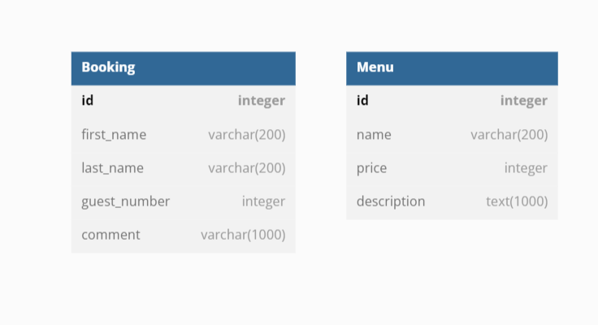
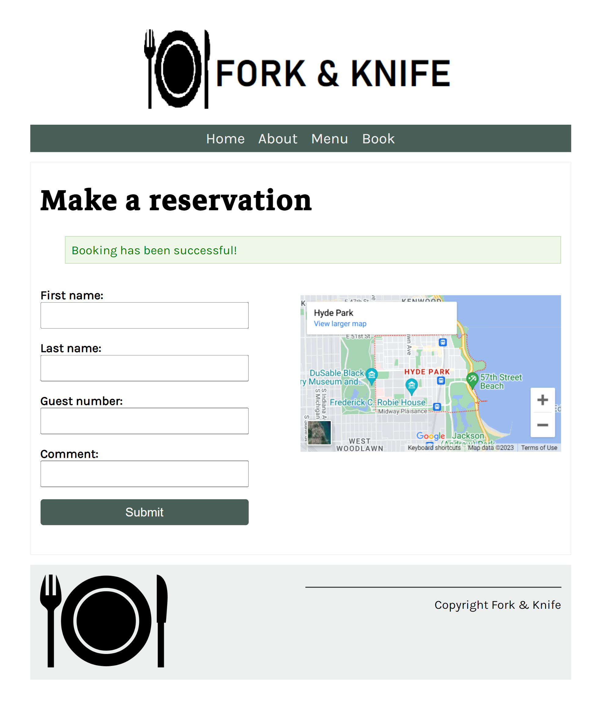
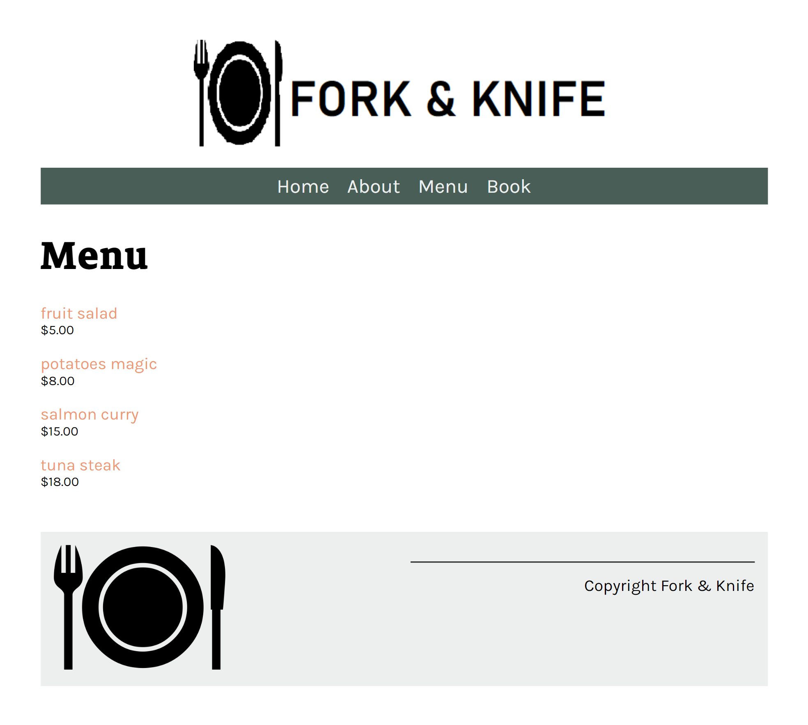
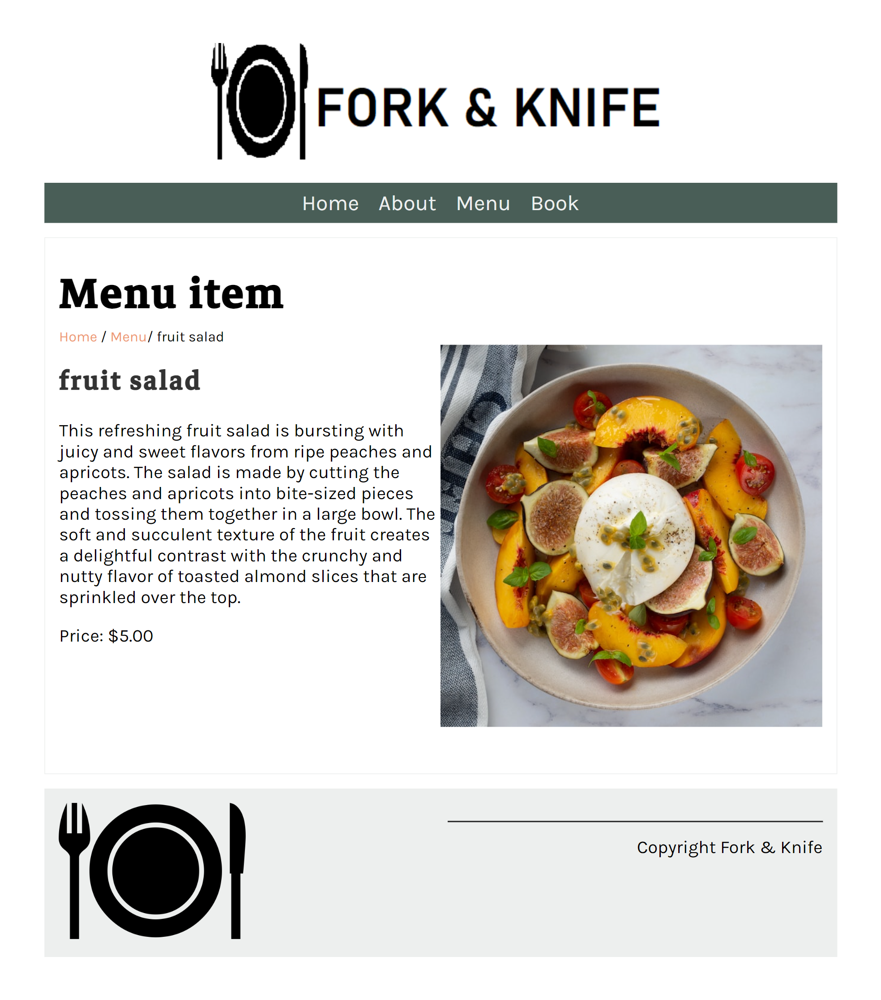
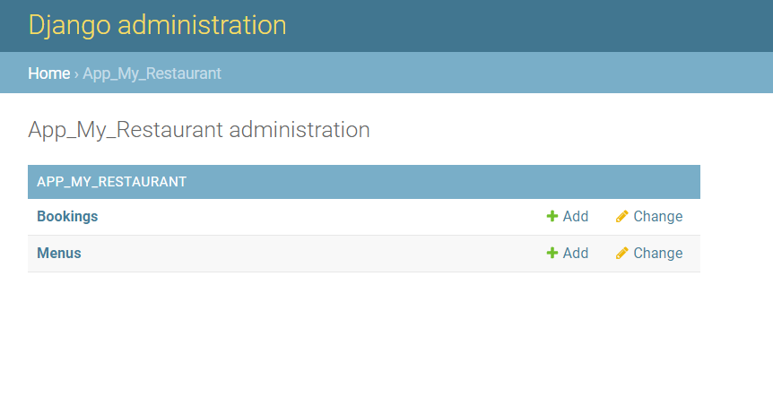
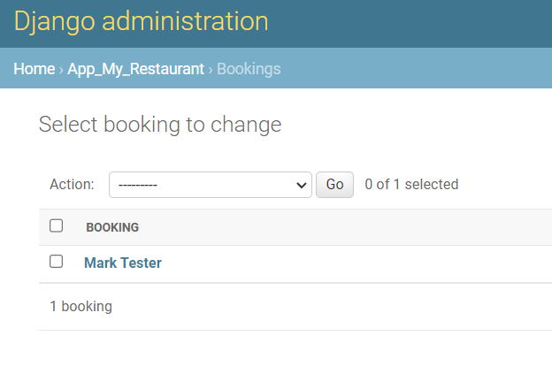
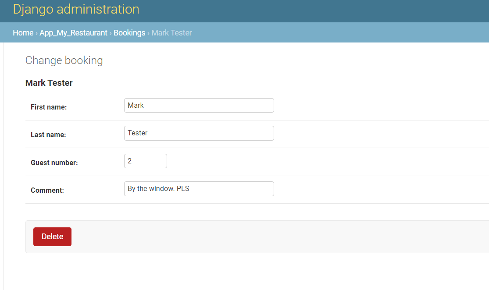
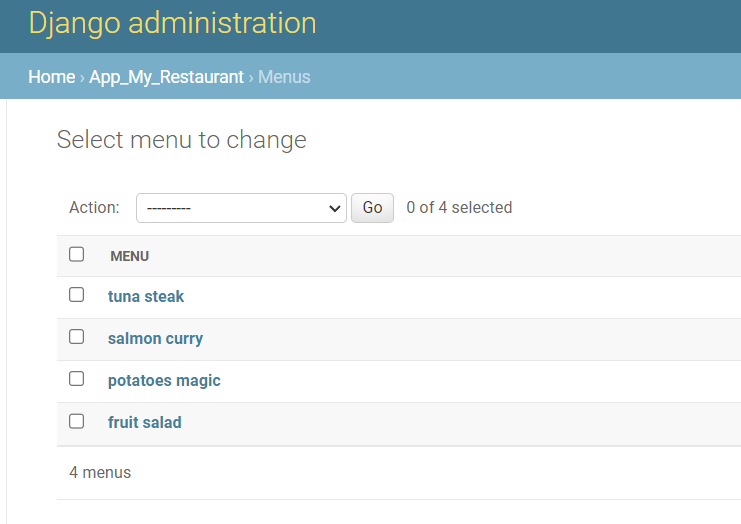
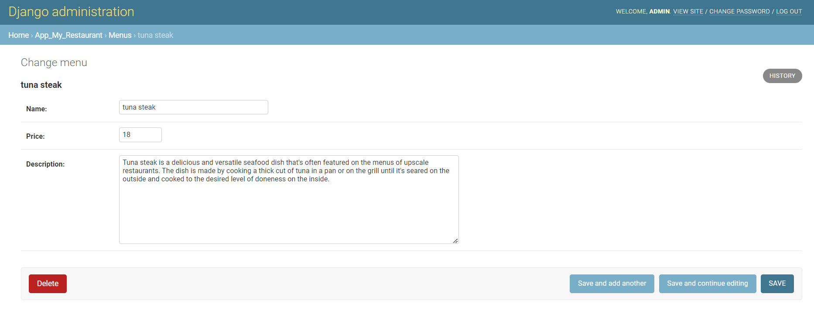

# 01-Restaurant-Webpage-Django
This is a restaurant website built with Django, a popular Python-based web framework. The website consists of four pages: Home, Menu, Book, and About. 
On the Home page, users can view an overview of the restaurant, including information about the cuisine and atmosphere. The Menu page displays all the dishes offered at the restaurant, with links to detailed descriptions and photos of each dish. 
The Book page allows users to make a reservation at the restaurant. They can select the number of people in their party, and any special requests they may have. The website uses Django's built-in forms to collect and validate user input. 
The About page provides a description of the restaurant and its owner, including their philosophy, history, and community involvement. 
The website is built using Django and uses Django messages to display feedback to users after they submit a form. The front end is styled with CSS and features nicely styled HTML. 
The data for the website is stored in a database (sqlite but it can be switched to MySQL). The owner of the restaurant can create a superuser account and use the Django admin panel to add menu items and manage bookings made through the website. They can view the bookings made by users. Overall, this is a simple but effective restaurant website that provides users with a seamless experience when booking a table or exploring the menu. 

---

Useful Links: 

Django 
https://docs.djangoproject.com/en/4.1/ 

Python 3.11 
https://docs.python.org/3/ 

Environmental variables 
https://pypi.org/project/python-dotenv/ 

---

**Database structure:** 
 

 

---

The necessary steps to make the program work: 
1. Install the Python version as stated in runtime.txt (python-3.11.2) 
2. Navigate in the console to the 01-Restaurant-Webpage-Django folder and install the required libraries from requirements.txt using the following command:  
*pip install -r requirements.txt* 
3. Change the name of .env.example to .env. 
4. Define the Django environmental variables in .env (https://docs.djangoproject.com/en/4.1/ref/settings/#std-setting-SECRET_KEY): 
**DJANGO_SECRET_KEY**="YOUR_DJANGO_SECRET_KEY"
**MYSQL_PASSWORD**="your_mysql_Databse_passsword" - only needed if switched to MySQL database
5. Run django migrations (https://docs.djangoproject.com/en/4.1/topics/migrations/). 
- python manage.py makemigrations  
- python manage.py migrate 
6. Create a superuser - the admin for the website. 
- python manage.py createsuperuser 
7. Now you can start the website with: 
- python manage.py runserver 
This will start the server in your local machine; the address will be something like: http://127.0.0.1:8000/, and this is where your website will be ready to play with. 

 
Additional: 

**I. ADDING MENU ITEMS** 
When you start your website, the menu webpage will not have any menu items listed. It is because the database is empty at the start and you need to add entries. You have to use the username and password of the superuser you created earlier, to log in at http://127.0.0.1:8000/admin . There, you have to navigate to Menus and add each item one by one. 
**PLEASE NOTE THAT THE NAME MUST MATCH THE FILE NAME IN THE DIRECTORY static/app_my_restaurant/img/menu_items**.
So if you have, for example, in this directory a file named 'fruit salad.jpg' you should write in the title 'fruit salad', This way, the picture will automatically get matched with this item. In this location you can also find a filed menu_desc.txt that will have alredy all the names and description for the pictures included, this way you can just copy and paste it when you add the items. 

**II. SWITCHING TO MySQL** 
The project was also preconfigured to use a MySQL database. In order to do so, necessary steps are needed. In the settings.py file, you would have to comment out the sqlite database settings and uncomment the MySQL database settings.
Next, you can use MySQL databases; just remember to check and adjust your settings for your MySQL database connection.
You will need: 
*'NAME':'mydatabase'*, - name of the database that you want to connect to. 
*'USER':'root'*, - name of the database user that you want to use for the connection 
*'PASSWORD':os.environ.get('MYSQL_PASSWORD')*, - password that you use to authenticate the user in the database 
*'HOST':'127.0.0.1'*, - host of the database to connect to 
*'PORT': '3306'*, - and port for the host 

 
You can also connect locally to a MySQL database, but first you will need to install and configure it on your local machine. For more information, follow this link: https://www.mysql.com/ 

 
YOU CAN USE THE CURRENT databse (db.sqlite3), 
superuser: 
username: admin 
password: admin 

---

**Example views from the website:** 
 

***main page.*** 
 

***about page.*** 
 

***booking page.*** 
 

***booking page - after posting.*** 
 

***menu page.*** 
 

***detail menu page - dish 1.*** 
 

***detail menu page - dish 2.*** 
 

***admin page.*** 
 

***admin page - booking view.*** 
 

***admin page - booking detail view*** 
 

***admin page - menu managment view.*** 
 

***admin page - menu managment detail view - dish 1.*** 
 

---

**The program was developed using python 3.11.2, Django 4.1, database - sqlite / MySQL**
