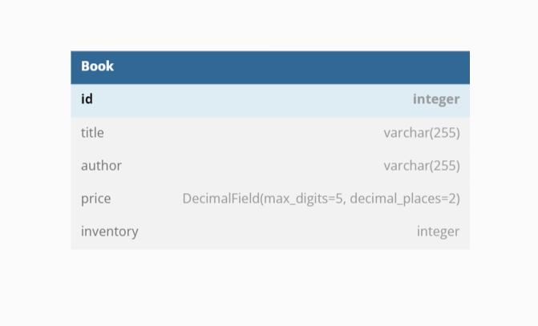
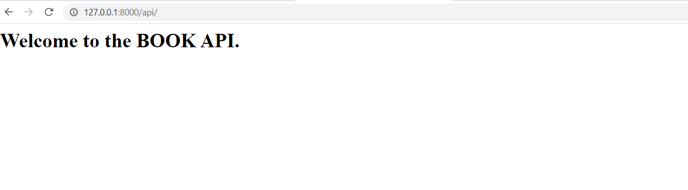
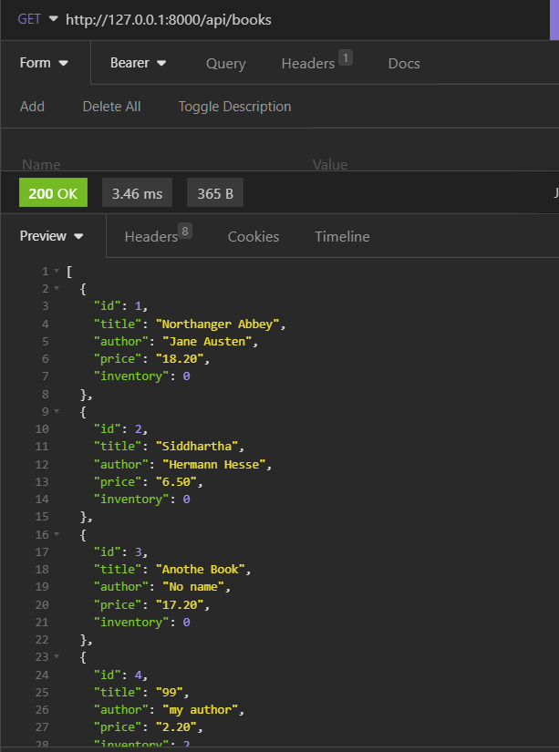
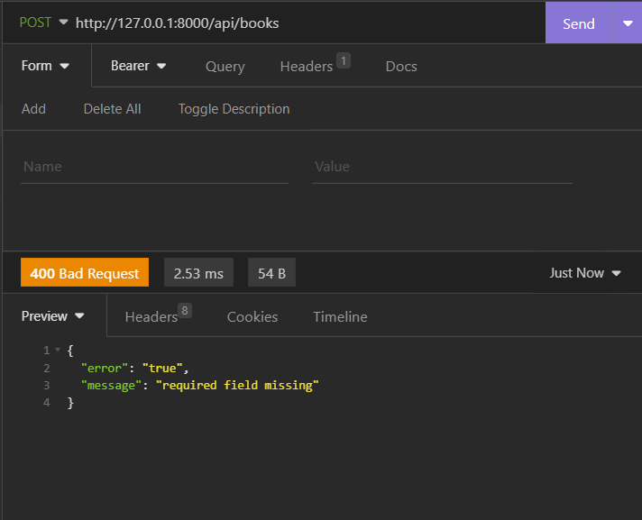
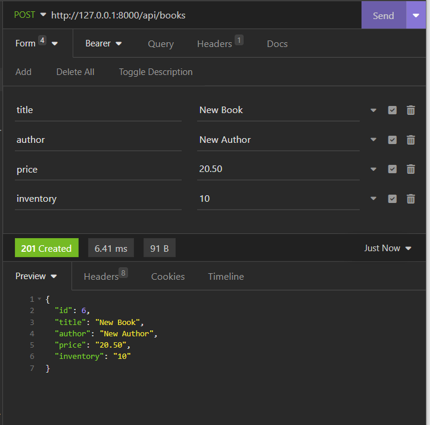
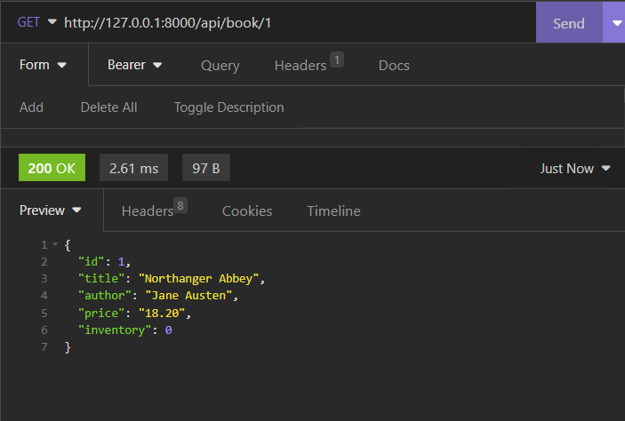
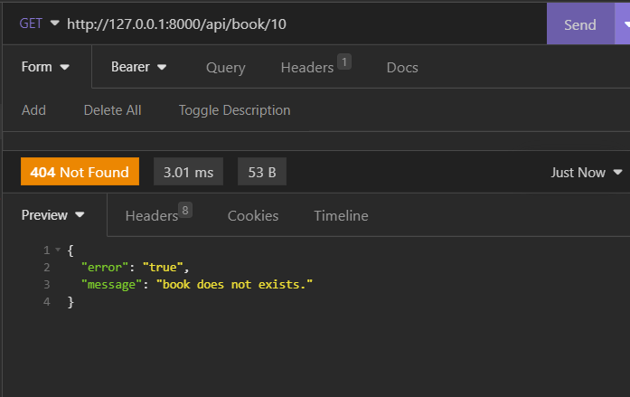
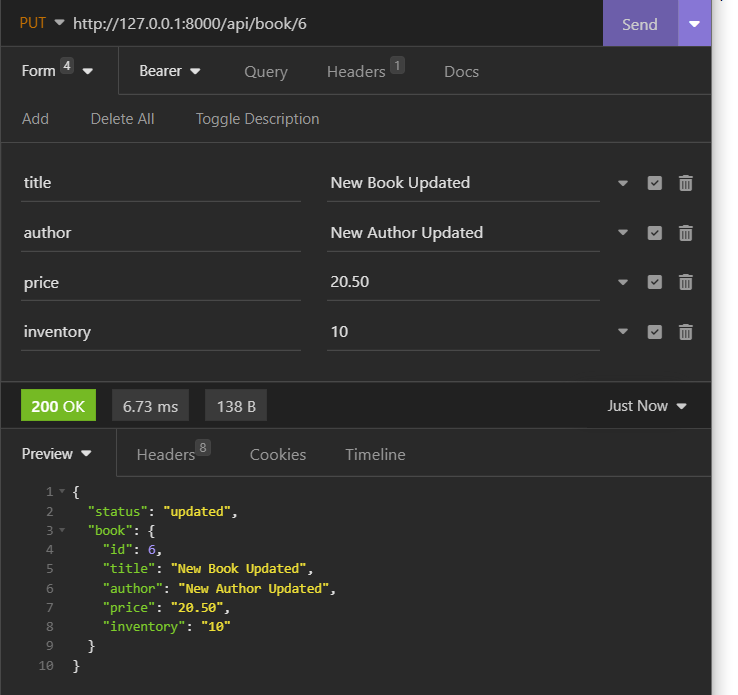
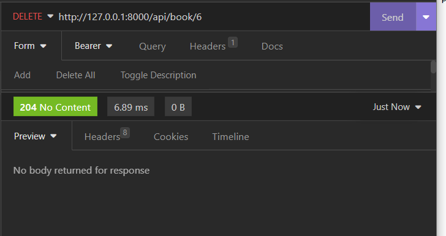

# 02-BookStore-API-Django
This is a robust RESTful API that facilitates easy management of books in a bookstore. It offers CRUD operations (Create, Read, Update, Delete) for interacting with a database where all the books will be stored. Currently, SQLite is used as the database, but the API has a configuration for MySQL that can be readily used. 
This API is user-friendly and has two endpoints and an index page that provides an introduction to the API. The first endpoint, */api/books*, can handle: 
- a GET request to retrieve a list of all books stored in the database, 
- a POST request to add a new book to the database. To add a book. 
For the POST request the API requires a payload containing information such as the book's 'title', 'author', 'price', and 'inventory' in JSON format sent as Form URL Encoded. 
The API's second endpoint, */api/books/{bookId}*, can handle: 
- a GET request to retrieve data on a single book stored in the database,  
- a PUT request to update a single book, which requires the same payload as the POST request, 
- a DELETE request used to delete a single book. 
The endpoint requires a unique book ID in the URL to reference the given book. 
Overall, the 02-BookStore-API-Django is an efficient and user-friendly API that simplifies book management in a bookstore. It offers a wide range of CRUD operations for managing books in the database, making it easy to add, update, retrieve, and delete books.

---

Useful Links: 

Django 
https://docs.djangoproject.com/en/4.1/ 

Python 3.11 
https://docs.python.org/3/ 

Environmental variables 
https://pypi.org/project/python-dotenv/ 

---

**Database structure:** 
 

 

---

The necessary steps to make the program work: 
1. Install the Python version as stated in runtime.txt (python-3.11.2) 
2. Navigate in the console to the 02-BookStore-API-Django folder and install the required libraries from requirements.txt using the following command:  
*pip install -r requirements.txt* 
3. Change the name of .env.example to .env. 
4. Define the Django environmental variables in .env (https://docs.djangoproject.com/en/4.1/ref/settings/#std-setting-SECRET_KEY): 
**DJANGO_SECRET_KEY**="YOUR_DJANGO_SECRET_KEY"
**MYSQL_PASSWORD**="your_mysql_Databse_passsword" - only needed if switched to MySQL database
5. Run django migrations (https://docs.djangoproject.com/en/4.1/topics/migrations/). 
- python manage.py makemigrations  
- python manage.py migrate 
6. Create a superuser - the admin for the website. 
- python manage.py createsuperuser 
7. Now you can start the website with: 
- python manage.py runserver 
This will start the server in your local machine; the address will be something like: http://127.0.0.1:8000/api/, and this is where your website will be ready to play with. 

 
Additional: 

**I. BROWSING BOOKS FROM THE ADMIN PAGE** 
When you start your website, the API will not have any book listed. It is because the database is empty at the start and you need to add entries. You can use the API endpoints to do so or you can use the credentials of the super user to login to the administration page http://127.0.0.1:8000/admin where you can also manage the books.

**II. SWITCHING TO MySQL** 
The project was also preconfigured to use a MySQL database. In order to do so, necessary steps are needed. In the settings.py file, you would have to comment out the sqlite database settings and uncomment the MySQL database settings.
Next, you can use MySQL databases; just remember to check and adjust your settings for your MySQL database connection.
You will need: 
*'NAME':'mydatabase'*, - name of the database that you want to connect to. 
*'USER':'root'*, - name of the database user that you want to use for the connection 
*'PASSWORD':os.environ.get('MYSQL_PASSWORD')*, - password that you use to authenticate the user in the database 
*'HOST':'127.0.0.1'*, - host of the database to connect to 
*'PORT': '3306'*, - and port for the host 

 
You can also connect locally to a MySQL database, but first you will need to install and configure it on your local machine. For more information, follow this link: https://www.mysql.com/ 

 
YOU CAN USE THE CURRENT databse (db.sqlite3), 
superuser: 
username: superuser 
password: superuser 

---

**Example views from the website / API:** 
 

***welcome page.*** 
***/api/*** 
 

***GET REQUEST: list books.*** 
***GET: api/books*** 
 

***POST REQUEST: adding a book to the database - bad request - missing arguments.*** 
***POST: api/books*** 
 

***POST REQUEST: adding a book to the database - with all the arguments as FORM URL ENCODED.*** 
***POST: api/books*** 
 

***GET REQUEST: retrieve data on specific book.*** 
***GET: api/books/{bookId}*** 
 

***GET REQUEST: retrieve data on specific book - error book not found.*** 
***GET: api/books/{bookId}*** 
 

***PUT REQUEST: update specific book.*** 
***PUT: api/books/{bookId}*** 
 

***DELETE REQUEST: delete specific book.*** 
***DELETE: api/books/{bookId}*** 
 

---

**The program was developed using python 3.11.2, Django 4.1, database - sqlite / MySQL**
