# 04-Restaurant-Management-API-DRF
This is a Management RESTful API for a restaurant, designed as a backend service to support a variety of client applications. The API enables customers to browse food items, view the item of the day, and place orders. Managers can use the API to update the item of the day, monitor orders, and assign deliveries. Delivery crew members can check orders assigned to them and update the status of an order once it's delivered. 

The system uses a database to store data, specifically SQLite. However, it is also preconfigured to use MySQL as an alternative database management system if needed. By utilizing a database to store data, the system can manage and access large amounts of information in an organized and efficient way. This allows for quick and easy retrieval of data when needed, as well as the ability to make changes and updates as necessary. The use of SQLite as the default database management system ensures that the system is reliable and efficient, while the option to use MySQL provides added flexibility and compatibility with other systems. 

Built with Django REST Framework, this RESTful API is fully functional and includes user authentication and authorization, which is managed through Djoser. Users can authenticate with a username and password to obtain individual tokens for authorization. The RESTful API supports three different user groups: managers, delivery crew, and customers. However, only two groups, managers and delivery crew, will be created for this project. Any user who doesn't belong to either of these groups will be considered a customer. 

The API includes endpoints for managing user registration and token generation, as well as endpoints for managing menu items, categories, user groups, carts, and orders. The endpoints are designed to handle the API's functionality and account for different user permissions. Most endpoints require authentication and authorization using an individual token obtained through the authentication process. 

This RESTful API implements additional features such as filtering, pagination, sorting, searching, and throttling to optimize performance and reduce the number of API calls. The API also returns proper error messages with appropriate HTTP status codes for specific errors such as unauthorized requests, invalid data in POST, PUT, or PATCH requests, or requests for non-existing items. 

The output data can be rendered as JSON or as HTML. 

In summary, this is a fully functional RESTful API - backend service for a restaurant, designed to support a variety of client applications. It includes user authentication and authorization, features for managing menu items, categories, user groups, carts, and orders, and uses the database for storing relevant information. It also includes filtering, pagination, sorting, searching, and throttling features to optimize performance. 

---

**DATABSE constraints and additional features:** 

Each user will have only one active cart, which can contain multiple menu items. The cart is a transitory order that customers can modify until they place the order. Once an order is placed, all items in the cart will be moved to the order items and will be linked to an order, and the cart will be emptied. After a successful order, customers can create a new cart. 

The API also includes additional tables in the database for storing information about categories, menu items, carts, orders, orders items, and user groups. The API enables managers to add, edit, and remove menu items, as well as update any user to a delivery person. Customers can browse menu items, filter them by categories and price ranges, and search menu items. Customers can also add menu items to their cart and place an order. Managers can browse orders and assign them to a delivery person, filter orders by their status, and delivery crew members can mark orders as delivered. 

**Database structure:** 
 

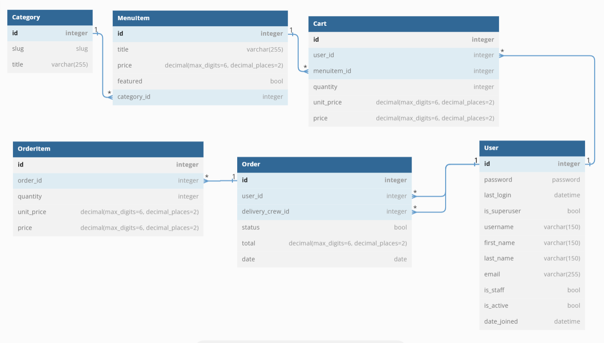 

---

**ENDPOINTS** 

**WELCOME PAGE** 

| Endpoints 	| Group  	| Method 	| DESCRIPTION  	|
|-----------	|--------	|--------	|--------------	|
| */api/*     | Anyone 	| *GET*   | Welcome Page 	|

 

**USER REGISTRATION AND TOKEN GENERATION** 
Here are djoser endpoints (https://djoser.readthedocs.io/en/latest/getting_started.html), listed only the most important; refer to the docs for more.
For authentication, you have to create a new user with a valid username and password; later, with this user, you can obtain a token, which you have to use in the HEADER of your request to authorise the request you will be making in this API. 

| Endpoints      	    | Group                                     	| Method 	| DESCRIPTION                                                         	|
|-------------------    |-------------------------------------------	|--------	|---------------------------------------------------------------------	|
| */auth/users*         | Anyone                                     	| *POST*   	| Creates a new user with the given: 'username', 'email', 'password'' 	|
| */auth/users/me/*     | Anyone with a valid token                 	| *GET*    	| Displays only the current user                                      	|
| */auth/token/login/*	| Anyone with a valid username and password 	| *POST*   	| Generates access tokens that can be used in other API calls         	|

 
You should have the Bearer Token configured as follows (example from Insomnia - and use a valid token): 

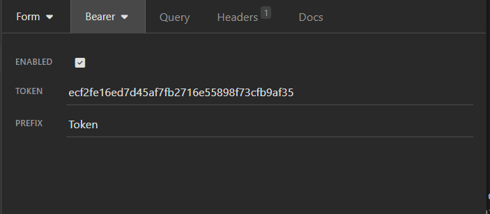 

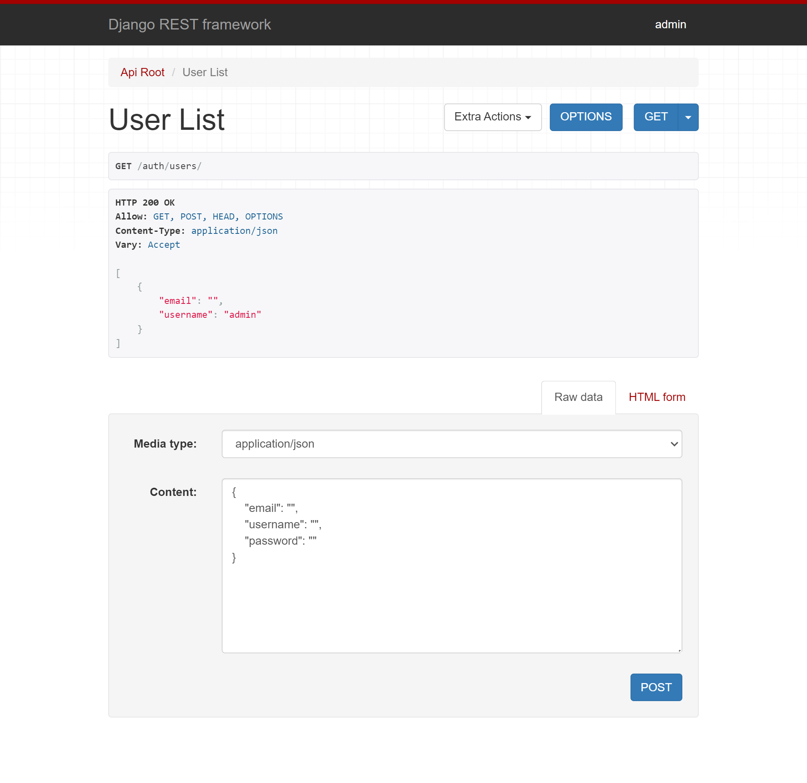 

**CATEGORIES** 
Endpoints to manage categories. 
Any other endpoints or different combinations of endpoints and methods will result in bad requests or unauthorised HTTP status errors. 

| Endpoints                    	| Group                   	| Method     	| DESCRIPTION              	|
|------------------------------	|-------------------------	|------------	|--------------------------	|
| */api/categories*            	| Customer, delivery crew 	| *GET*        	| List all categories.     	|
| */api/categories/{categoryId}*| Customer, delivery crew 	| *GET*        	| Lists single category.   	|
| */api/categories*            	| Manager                 	| *GET*        	| List all categories.     	|
| */api/categories*            	| Manager                 	| *POST*       	| Creates a new category. 	|
| */api/categories/{categoryId}*| Manager                 	| *GET*        	| Lists single category.   	|
| */api/categories/{categoryId}*| Manager                 	| *PUT*, *PATCH*| Updates single category. 	|
| */api/categories/{categoryId}*| Manager                 	| *DELETE*     	| Deletes single category. 	|

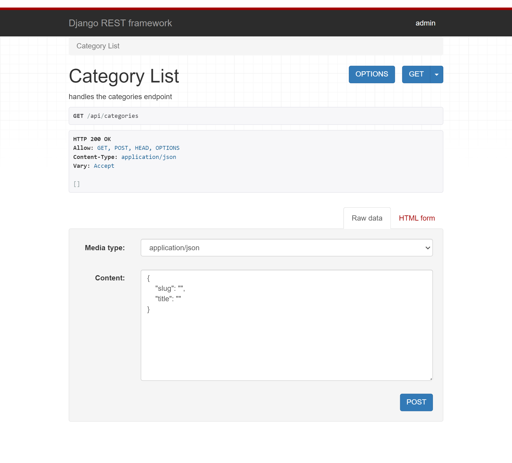 

**MENU ITEMS** 
Endpoints to manage menu items. 
Any other endpoints or different combinations of endpoints and methods will result in bad requests or unauthorised HTTP status errors. 

| Endpoints                    	| Group                   	| Method     	| DESCRIPTION              	|
|------------------------------	|-------------------------	|------------	|--------------------------	|
| */api/menu-items*            	| Customer, delivery crew 	| *GET*        	| List all menu items.     	|
| */api/menu-items/{menuItemId}*| Customer, delivery crew 	| *GET*        	| Lists single menu item.  	|
| */api/menu-items*            	| Manager                 	| *GET*        	| List all menu items.     	|
| */api/menu-items*            	| Manager                 	| *POST*       	| Creates a new menu item. 	|
| */api/menu-items/{menuItemId}*| Manager                 	| *GET*        	| Lists single menu item.  	|
| */api/menu-items/{menuItemId}*| Manager                 	| *PUT*, *PATCH*| Updates single menu item. |
| */api/menu-items/{menuItemId}*| Manager                 	| *DELETE*     	| Deletes single menu item.	|

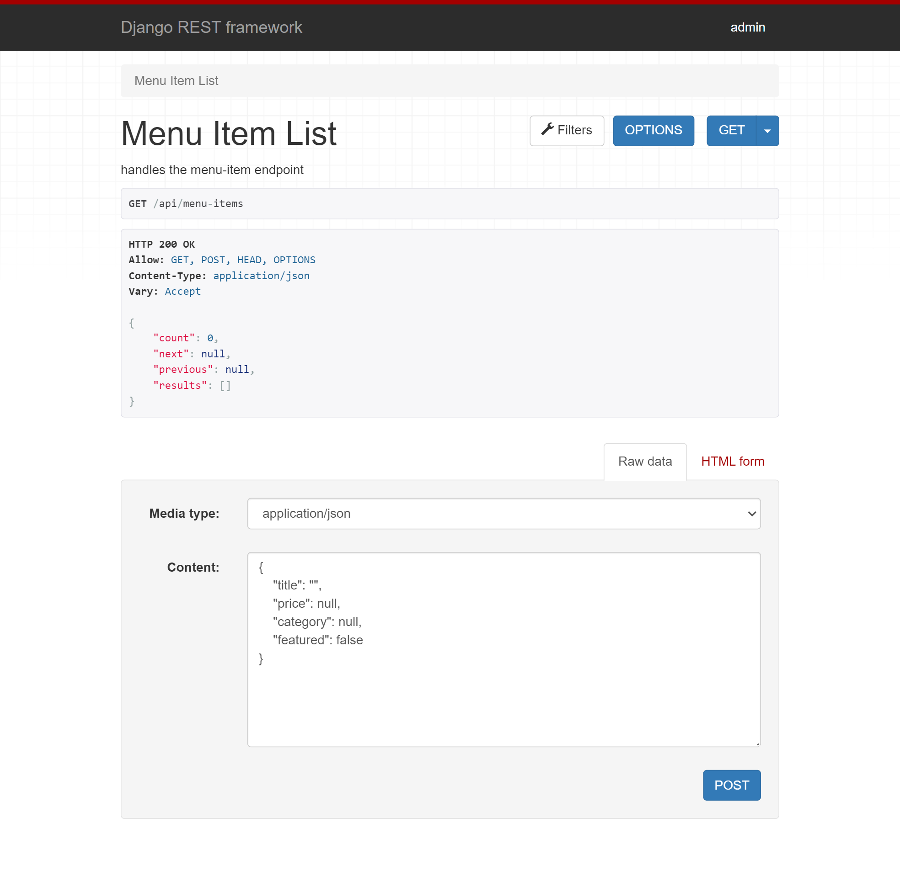 

**USER GROUP MANAGMENT** 
Endpoints to manage the assignment of users to the Manager or Delivery Crew groups. 
Any other endpoints or different combinations of endpoints and methods will result in bad requests or unauthorised HTTP status errors. 

| Endpoints                                	| Group            	| Method 	| DESCRIPTION                                                	|
|------------------------------------------	|------------------	|--------	|------------------------------------------------------------	|
| */api/groups/manager/users*               | Manager or Admin 	| *GET*    	| List all managers.                                         	|
| */api/groups/manager/users*               | Manager or Admin 	| *POST*   	| Asigns the user in the payload to the manager group.       	|
| */api/groups/manager/users/{userId}*      | Manager or Admin 	| *DELETE* 	| Removes this particular user from the manager group.       	|
| */api/groups/delivery-crew/users*         | Manager or Admin 	| *GET*    	| List all delivery crew.                                    	|
| */api/groups/delivery-crew/users*         | Manager or Admin 	| *POST*   	| Asigns the user in the payload to the delivery crew group. 	|
| */api/groups/delivery-crew/users/{userId}*| Manager or Admin 	| *DELETE* 	| Removes this particular user from the delivery crew group. 	|

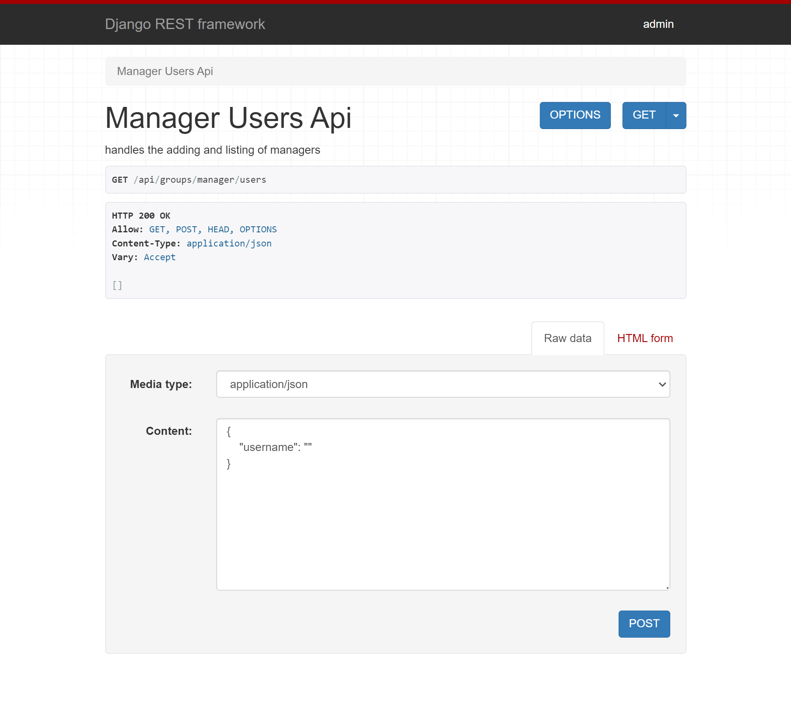 

**CART MANAGMENT** 
Endpoints to manage the assignment of menu items to the cart by a customer. 
Any other endpoints or different combinations of endpoints and methods will result in bad requests or unauthorised HTTP status errors. 

| Endpoints            	| Group     	| Method 	| DESCRIPTION                                                                        	|
|----------------------	|-----------	|--------	|------------------------------------------------------------------------------------	|
| */api/cart/menu-items*| Customers 	| *GET*    	| Returns current items in the cart from the current user token.                     	|
| */api/cart/menu-items*| Customers 	| *POST*   	| Adds the menu item to the cart. Sets the authenticated user as owner of this cart. 	|
| */api/cart/menu-items*| Customers 	| *DELETE* 	| Deletes all menu items created by the current user token.                          	|

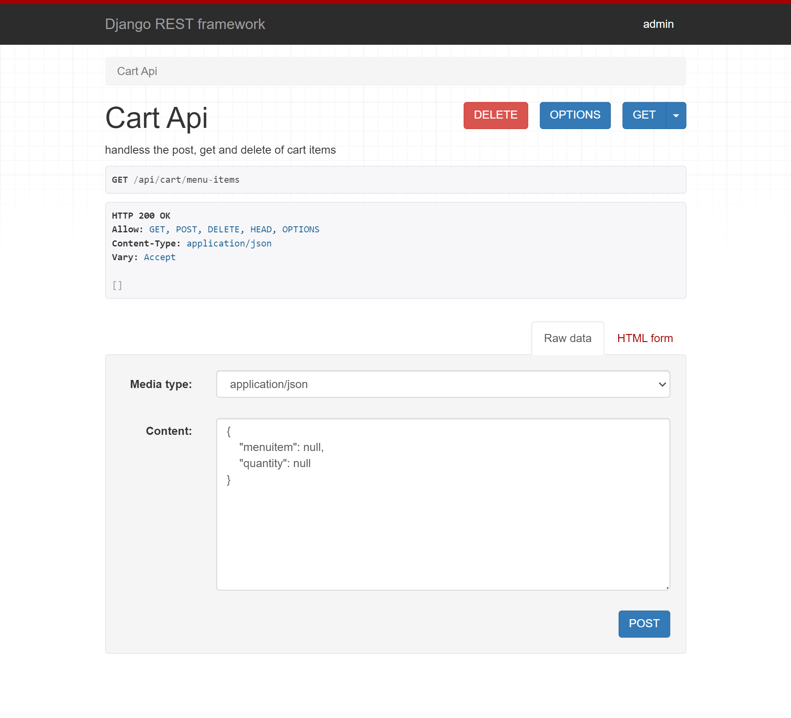 

**ORDER MANAGMENT** 
Endpoints to manage the orders. 
Any other endpoints or different combinations of endpoints and methods will result in bad requests or unauthorised HTTP status errors. 
This endpoint: */api/orders* can be used interchangeably with */api/cart/orders* . 

| Endpoints             	| Group         	| Method     	| DESCRIPTION                                                                                                                	|
|-----------------------	|---------------	|------------	|----------------------------------------------------------------------------------------------------------------------------	|
| */api/orders*           	| Customers     	| *GET*        	| Returns all orders with order items created by this user.                                                                  	|
| */api/orders*           	| Customers     	| *POST*       	| Creates a new order, transfers all cart items to order items, and deletes the cart for the current user.                   	|
| */api/orders/{orderId}* 	| Customers     	| *GET*        	| Returns the given order with all the order items for the current user.                                                     	|
| */api/orders*           	| Manager       	| *GET*        	| Lists all orders with order items for all users.                                                                           	|
| */api/orders/{orderId}* 	| Manager       	| *PUT*, *PATCH*| Updates the given order. Managers can use this endpoint to asign users to delivery crew and change the status of an order. 	|
| */api/orders*           	| Delivery Crew 	| *GET*        	| List all orders with order items assigned to the authenticated delivery crew user.                                         	|
| */api/orders/{orderId}* 	| Delivery Crew 	| *PATCH*      	| A delivery crew user can update the status of the given order from 0 to 1.                                                 	|

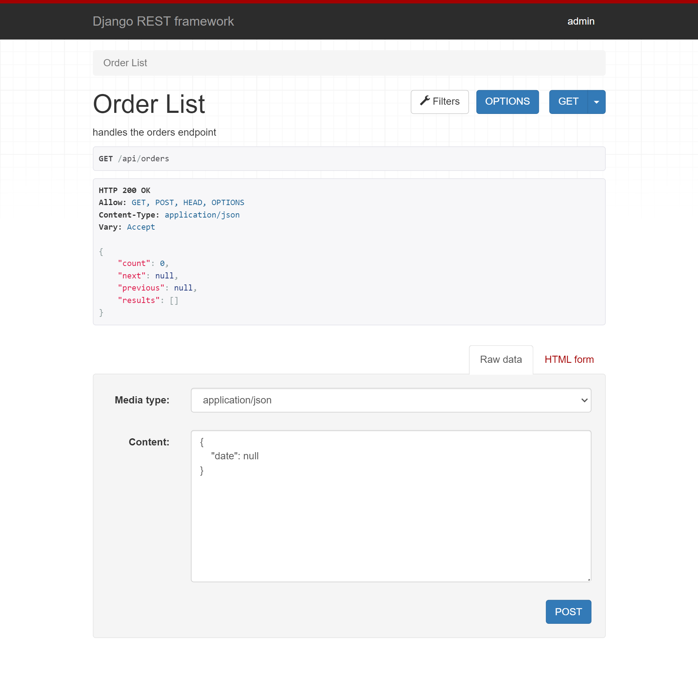 

**Additionaly** 
These endpoints have filtering, pagination, search and sorting capabilities implemented: 
- /api/orders, 
- /api/menu-items, 
- /api/categories, 

---

Useful Links: 

Django REST framework (DRF) 
https://www.django-rest-framework.org/ 

Djoser 
https://djoser.readthedocs.io/en/latest/getting_started.html 

Django 
https://docs.djangoproject.com/en/4.1/ 

Python 3.11 
https://docs.python.org/3/ 

Environmental variables 
https://pypi.org/project/python-dotenv/ 

---

The necessary steps to make the program work: 
1. Install the Python version as stated in runtime.txt (python-3.11.2) 
2. Navigate in the console to the 04-Restaurant-Management-API-DRF folder and install the required libraries from requirements.txt using the following command:  
*pip install -r requirements.txt* 
3. Change the name of .env.example to .env. 
4. Define the Django environmental variables in .env (https://docs.djangoproject.com/en/4.1/ref/settings/#std-setting-SECRET_KEY): 
**DJANGO_SECRET_KEY**="YOUR_DJANGO_SECRET_KEY" 
**MYSQL_PASSWORD**="your_mysql_Databse_passsword" - only needed if switched to MySQL database 
5. Run django migrations (https://docs.djangoproject.com/en/4.1/topics/migrations/). 
- python manage.py makemigrations  
- python manage.py migrate 
6. Create a superuser - the admin for the website. 
- python manage.py createsuperuser 
7. Now you can start the website with: 
- python manage.py runserver 
This will start the server in your local machine; the address will be something like: http://127.0.0.1:8000/api/, and this is where your website will be ready to play with. 

**You should see a welcome page under http://127.0.0.1:8000/api/** 
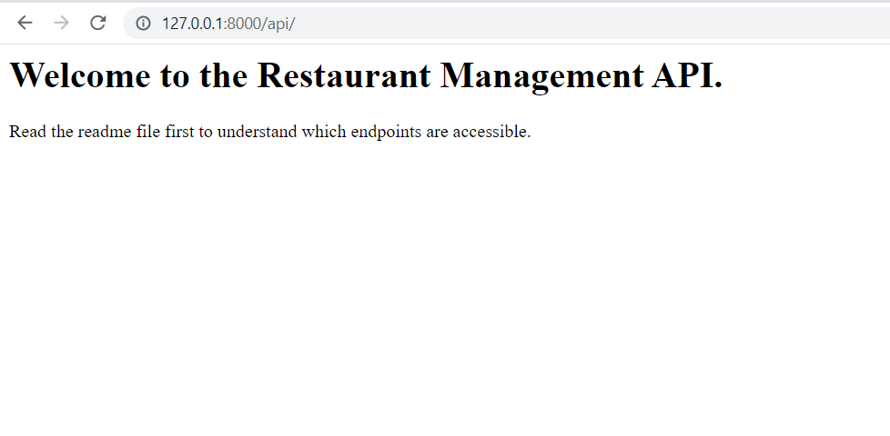 

8. First you will have to create two groups. Login to the administarion of the webpage http://127.0.0.1:8000/admin/ with credentails created in the point 6, and next: 
- create two groups, 'Manager' and 'Delivery_Crew', (make sure your names are exatly the same) 

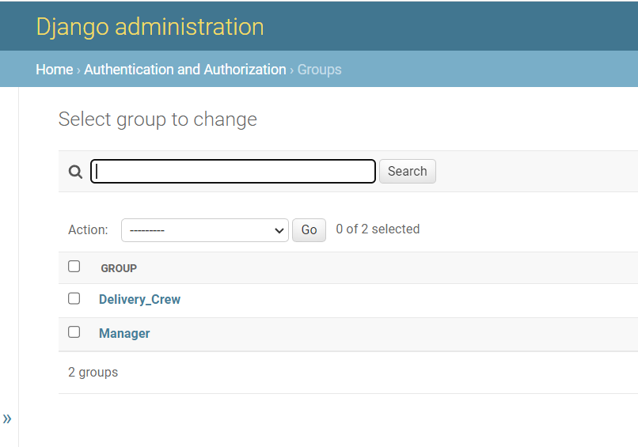 
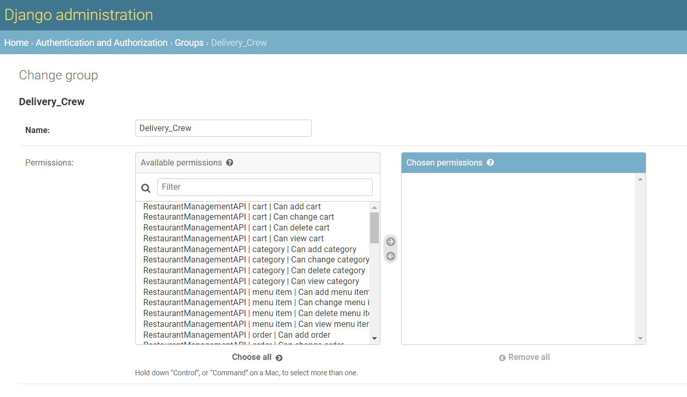 

- now create 4 users, and make sure to assign one user to the Manager group and one user to the Delivery Crew. You can create more or none at all; it is up to you. We just do this step so you can fully test this application; you can skip this step if you want to register users with the help of API endpoints or you want to do it later. 

- You can also add categories and menu-items from the admin site or add them using the API endpoints. It is completely up to you how you want it to do it. For testing, it is more convenient to do it from the administration side, but for production, only the API endpoints will be available! 

Additional: 

**I. SWITCHING TO MySQL** 
The project was also preconfigured to use a MySQL database. In order to do so, necessary steps are needed. In the settings.py file, you would have to comment out the sqlite database settings and uncomment the MySQL database settings.
Next, you can use MySQL databases; just remember to check and adjust your settings for your MySQL database connection.
You will need: 
*'NAME':'mydatabase'*, - name of the database that you want to connect to. 
*'USER':'root'*, - name of the database user that you want to use for the connection 
*'PASSWORD':os.environ.get('MYSQL_PASSWORD')*, - password that you use to authenticate the user in the database 
*'HOST':'127.0.0.1'*, - host of the database to connect to 
*'PORT': '3306'*, - and port for the host 

 
You can also connect locally to a MySQL database, but first you will need to install and configure it on your local machine. For more information, follow this link: https://www.mysql.com/ 

**II. Using the current database** 
YOU CAN USE THE CURRENT databse (db.sqlite3), 
then you can skip step 8 for creating content. OR you can delete it and create your own / new database. After creating the database, make sure you follow step 8 and, in particular, don't forget about adding these two groups mentioned above. 

superuser: 
username: admin 
password: admin 

For your convenience, the rest of the users and passwords configured in the database can be found in the users.txt file. 
The file menu-items.txt contains some sample data (menu) that can be added to the categories in the admin panel.  

**III. How to test the API** 
There are various ways you can check the functionality of this API. Here are the three most common ways you could do that:
1. You can simply open your favourite browser and navigate to the endpoints; they will be displayed with the help of the Django REST framework API interface, which is interactive and gives you direct access to all the endpoints configured. Just remember that if you are logged in as an administrator, you will be assigned the appropriate permissions; since session authorization is also active, this would give you admin authorization for every endpoint. You might want to change the authorization to the delivery crew member, manager, or customer if you want to test different functionality.
2. You can use POSTMAN (https://www.postman.com/) to check the endpoints and functionality.
3. You can use INSOMNIA (https://insomnia.rest/) to check the endpoints and functionality.

---

**Example responses / requests from the API:** 
 

***Register a user.*** 
***/auth/users/*** 
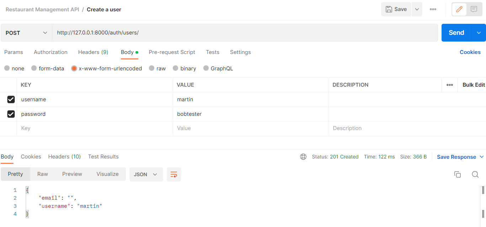 

***Creates a token for the given user.*** 
***/auth/token/login*** 
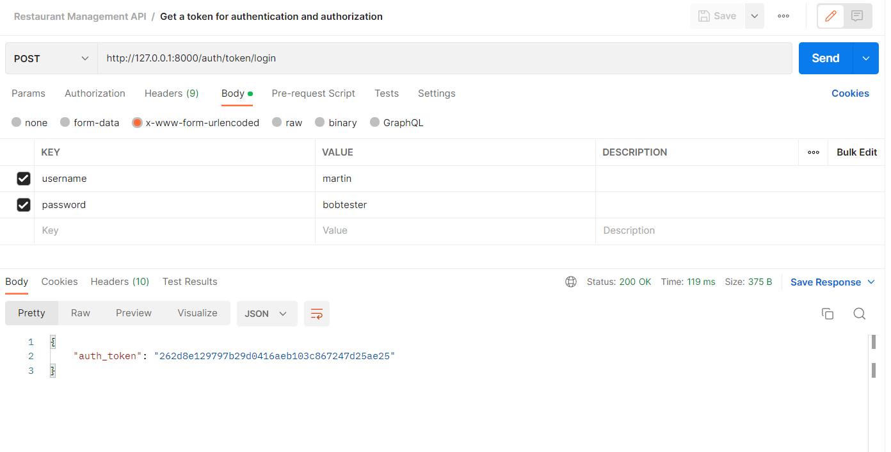 

***get the current authenticated user, you need to send the token in the header.*** 
***/auth/users/me*** 
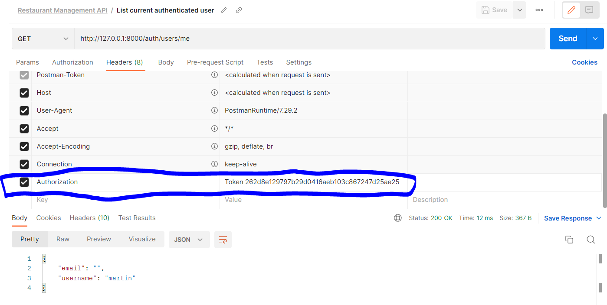 

***list categories as customer, you need to send the token in the header.*** 
***/api/categories*** 
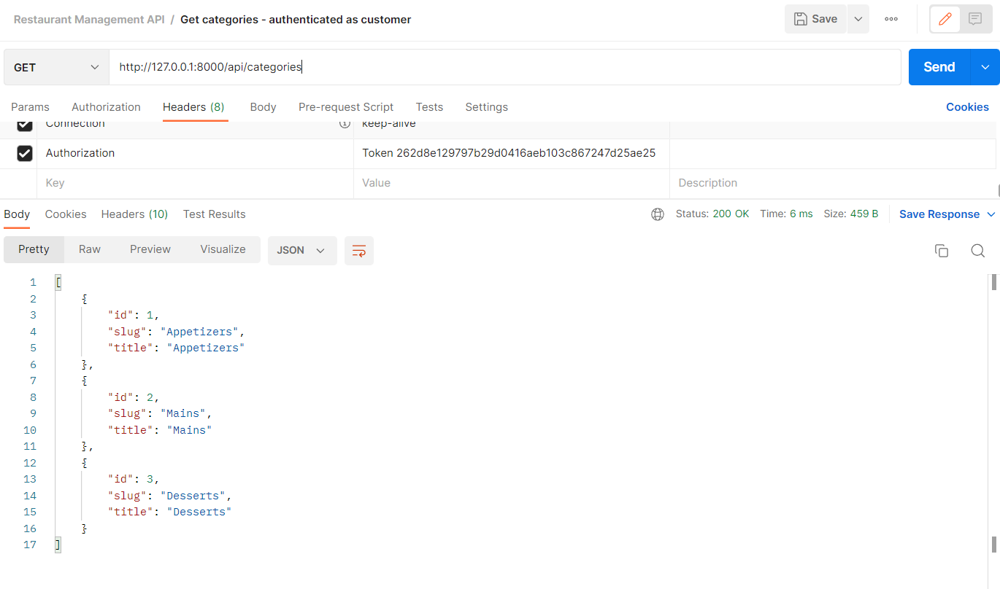 

***list menu-items as customer, you need to send the token in the header.*** 
***you can also use pagination, filtering, search and ordering.*** 
***/api/menu-items*** 
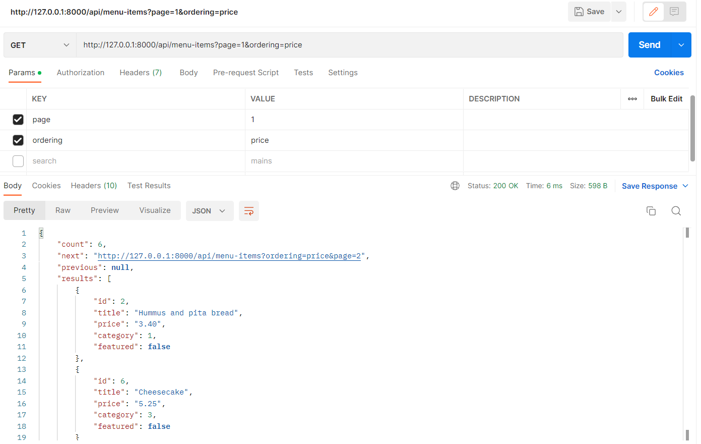 
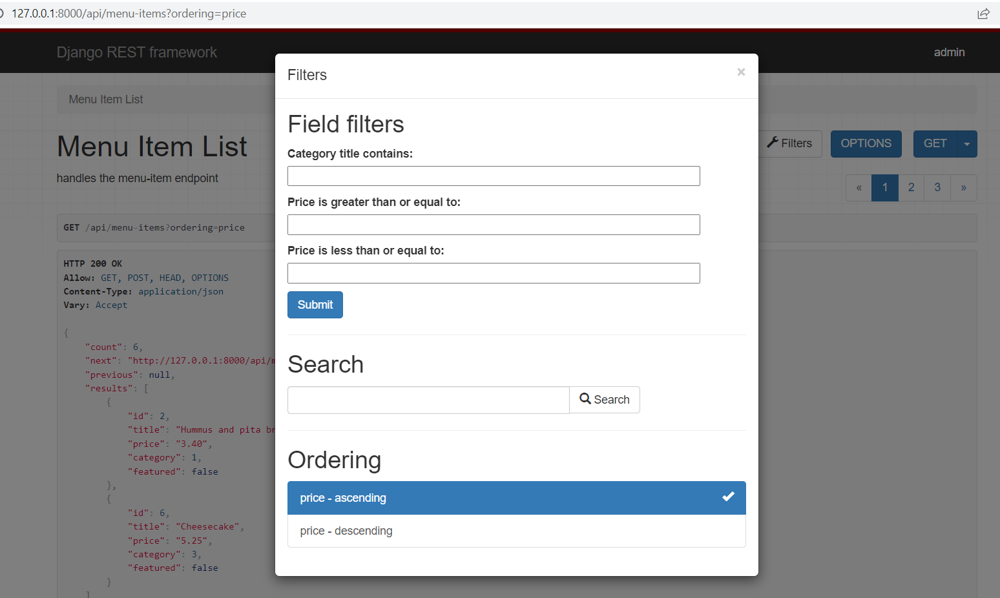 

***adding menu-items as customer, you need to send the token in the header.*** 
***you need to to specify the 'menu item id' and 'quntity'.*** 
***/api/cart/menu-items*** 
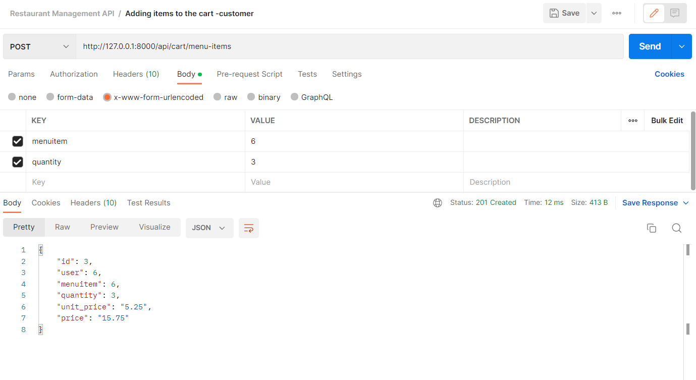 

***checking the cart.*** 
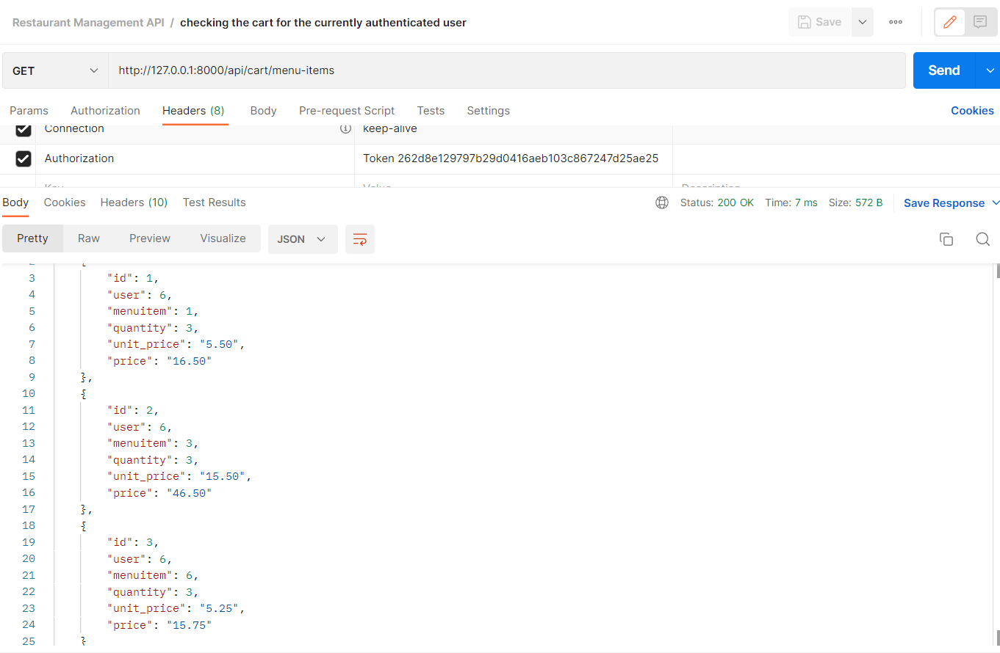 

***creating as order as customer, you need to send the token in the header.*** 
***all menu itesm wil be moved to order items, and the cart will get emptied.*** 
***You need to specify the 'date' as YYYY-MM-DD.*** 
***Status is set as false - not delivered*** 
***delivery crew is set to null as not asigned*** 
***/api/orders*** 
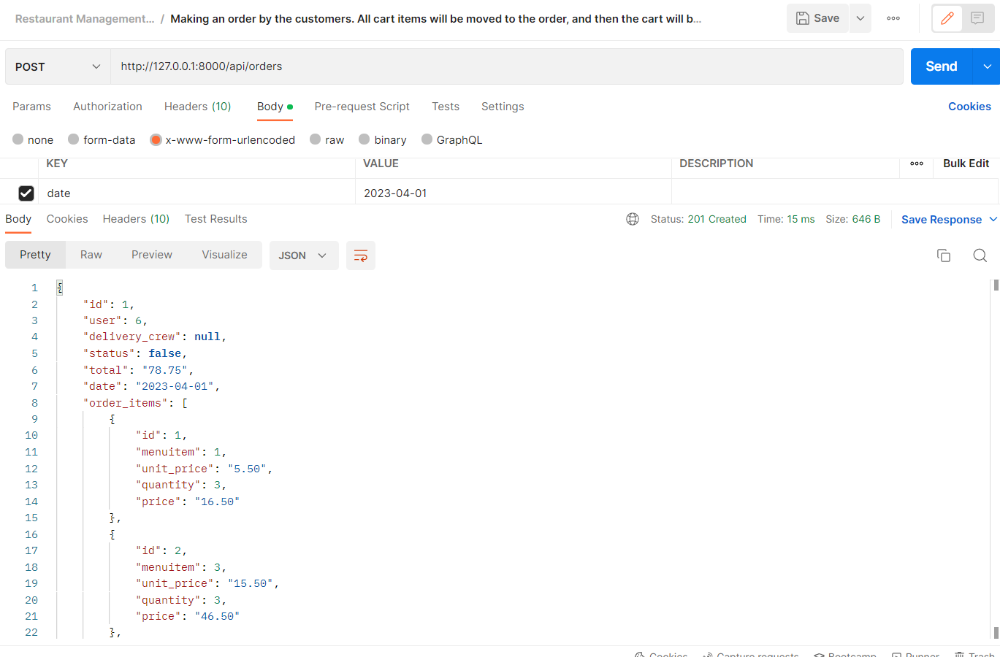 

***You can also use filtering and ordering in the orders endpoint*** 
***You can search by the delivery crew username or by the username who placed the order*** 
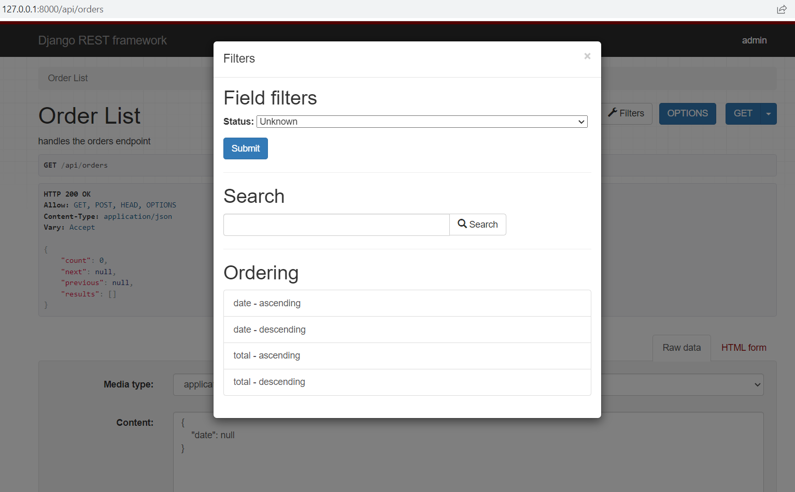 

***If you make a request at any point that lacks necessary data, you will get an error message!*** 
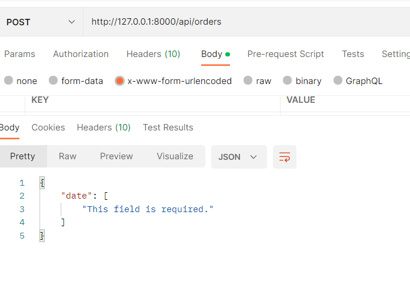 

***Or if you forget to add the token!*** 
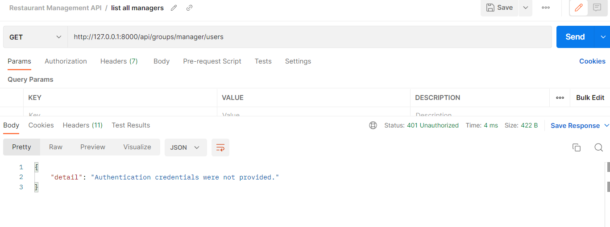 

***Now a manager can asign a user to the delivery crew*** 
***For that you need to use a manager or admin token!*** 

***api/groups/manager/users*** 
***list all current managers*** 
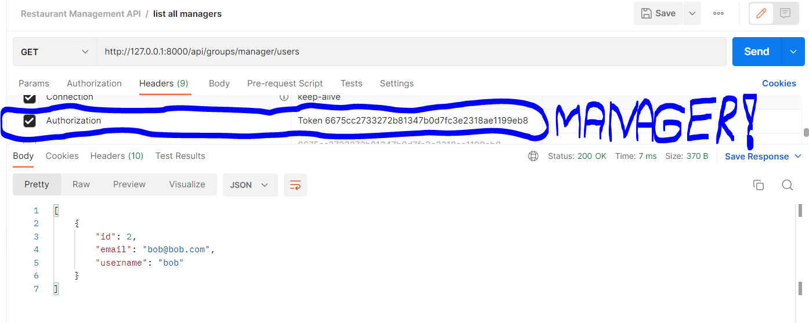 

***api/groups/delivery-crew/users*** 
***adding a user to the delivery crew*** 
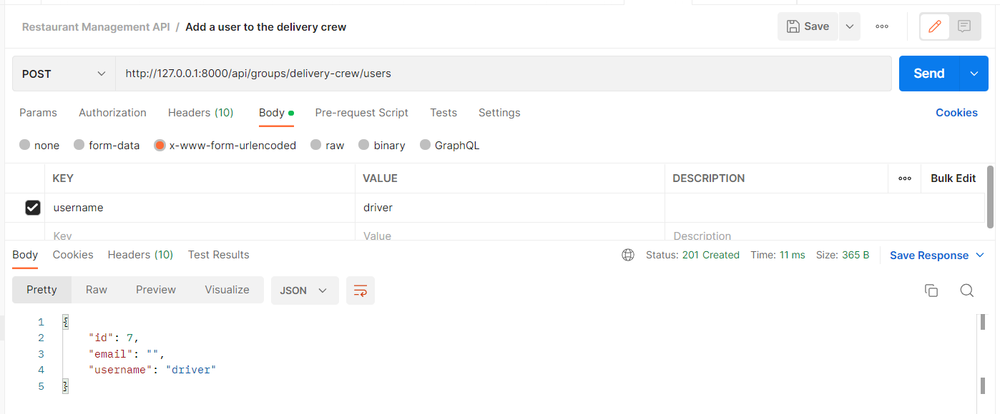 

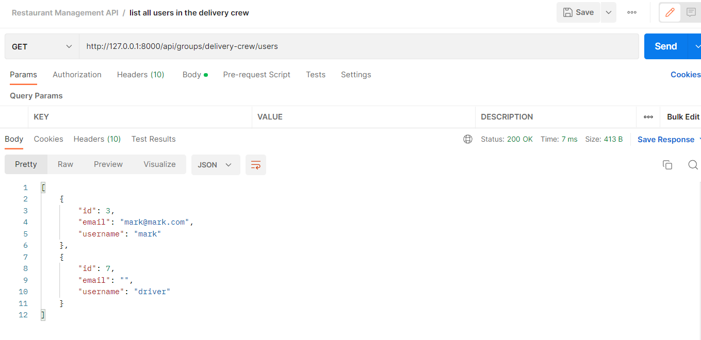 

***Manager can assign a order to a delivery crew*** 
***for Put request - delivery_crew and status has to be defined*** 
***for Patch request - delivery_crew or status or nothing has to be defined*** 
***api/orders/1*** 
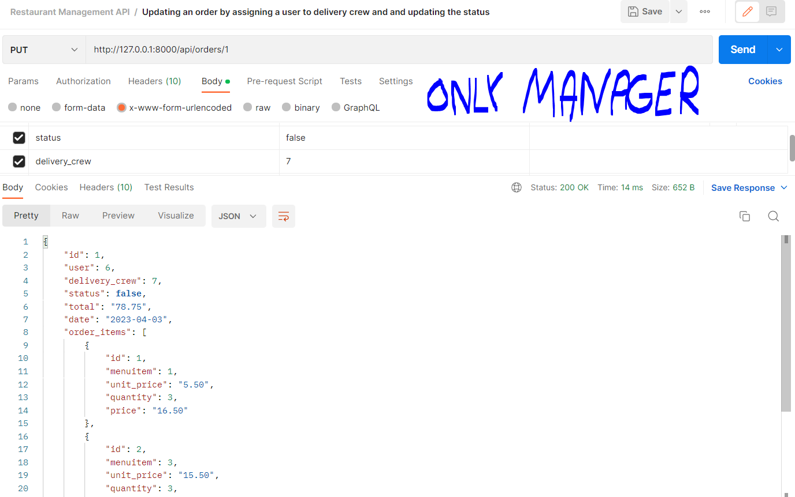 

***Now the delivery crew user can list all orders asigned to them, and can also perform a sort by status.*** 
***api/orders*** 
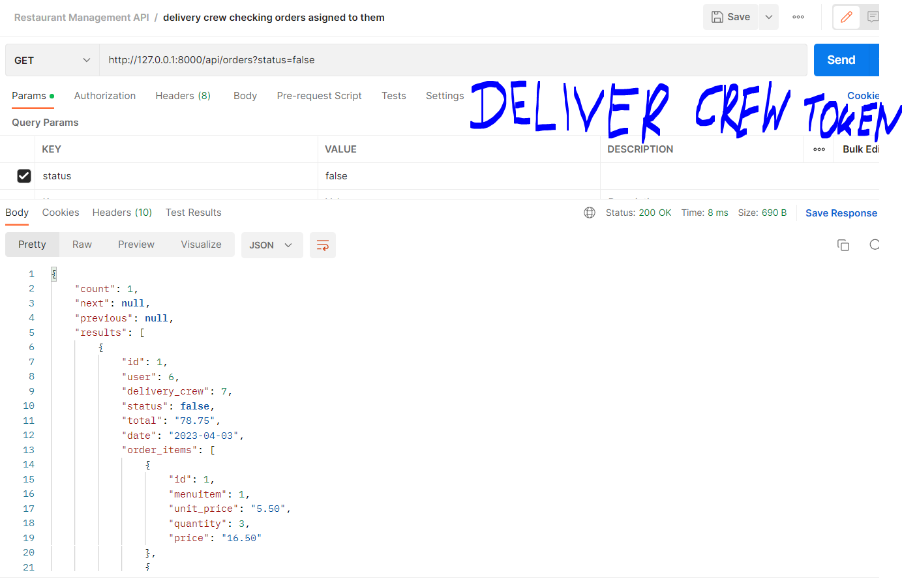 

***Now the delivery crew user can updated the status indicating weather it was deliverd or not.*** 
***Delivery crew user will be allowed to update only the status!*** 
***api/orders/1*** 
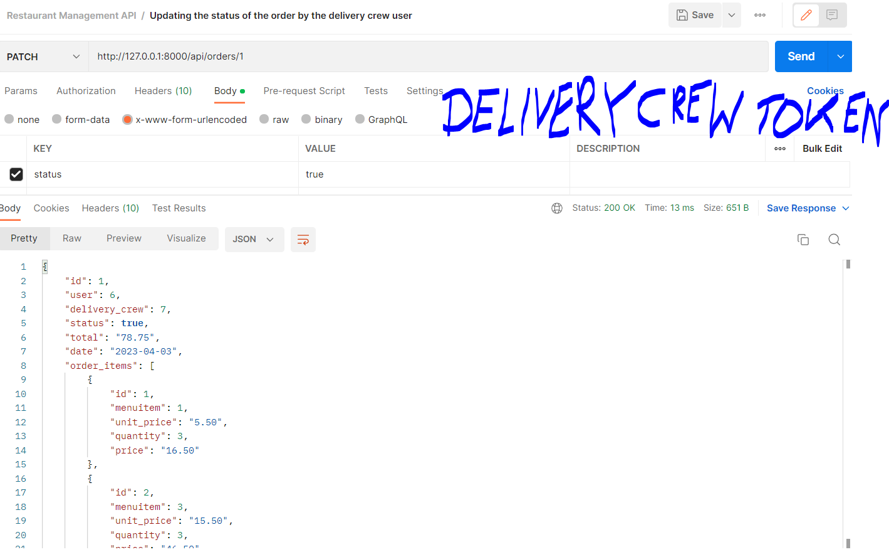 

***Now the manager can delete the order*** 
***api/orders/1*** 
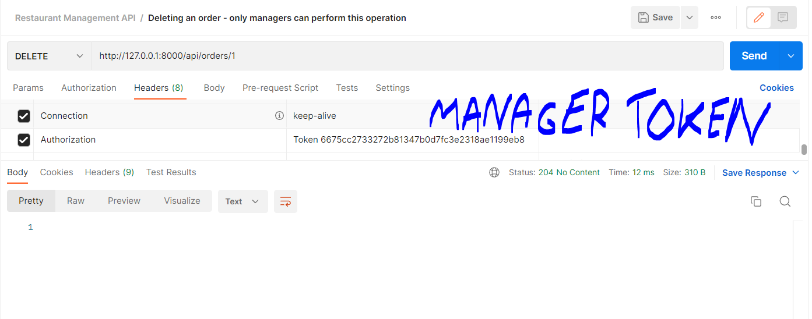 

 
 
 

---

***There are many more endpoints to explore; this is just a brief introduction to some of the functions. Whenever you send an incomplete request, you will receive an appropriate error message. For more information about which endpoints to use, refer to the "Endpoints" section at the top, where they are listed in tables with descriptions.*** 

---

**The program was developed using python 3.11.2, Django 4.1, database - sqlite / MySQL, Django REST Framework 3.14, Djoser**
