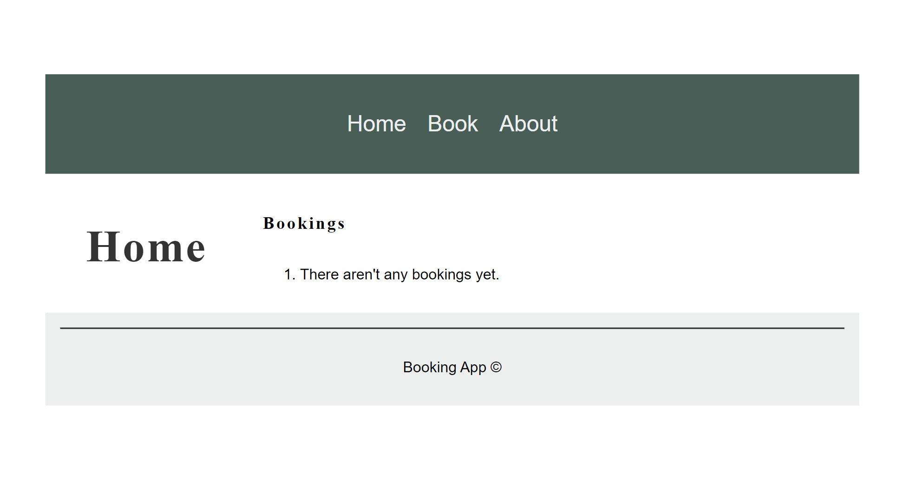
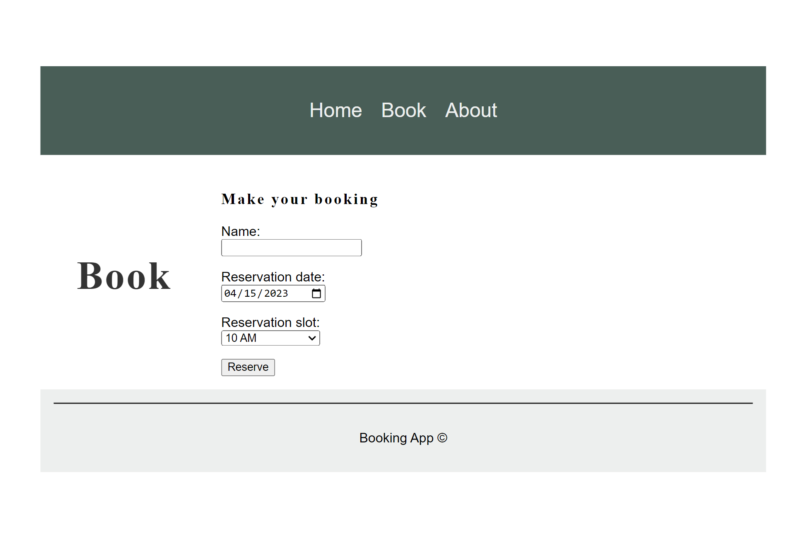
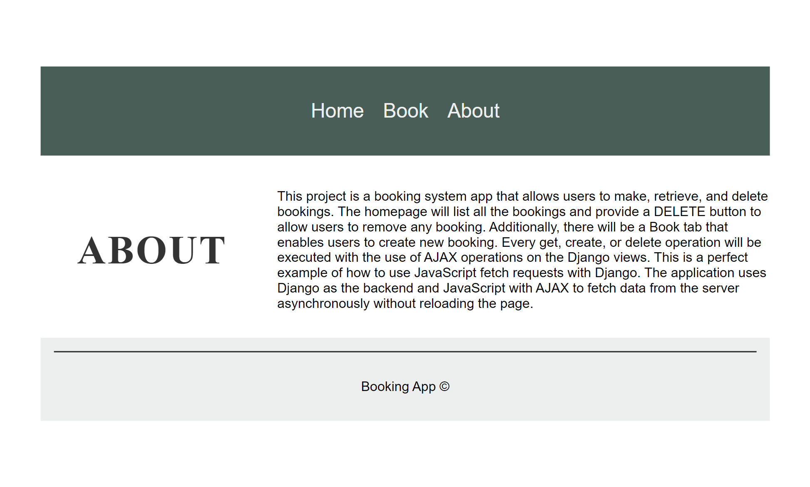
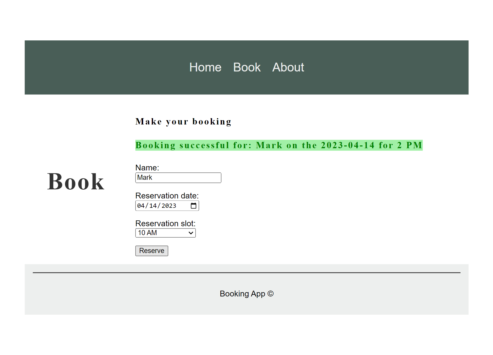
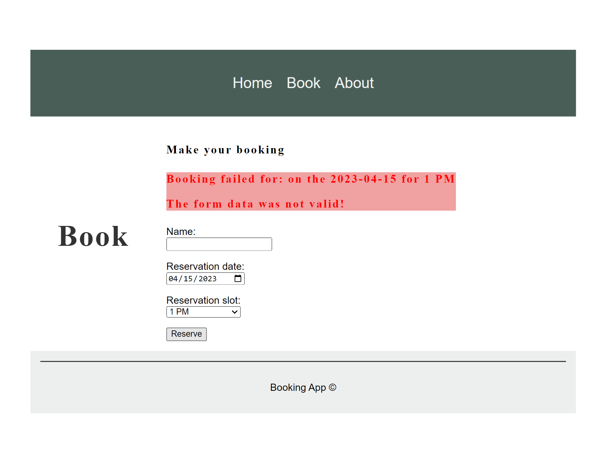
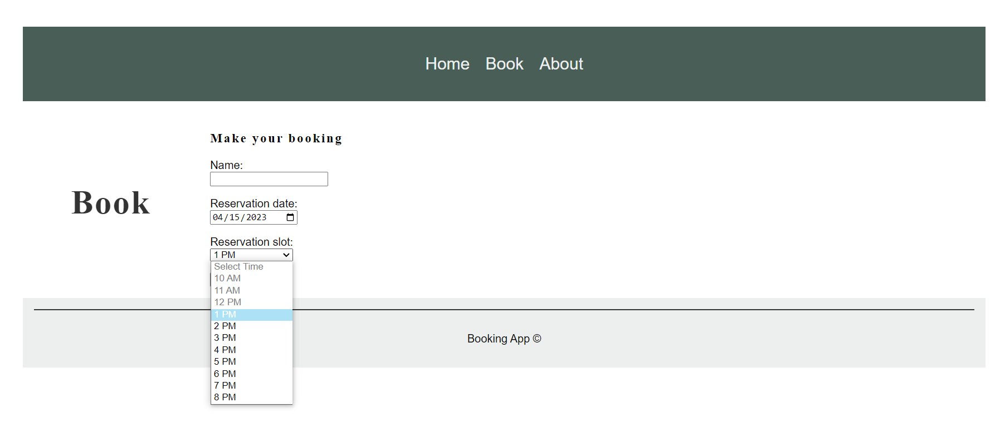
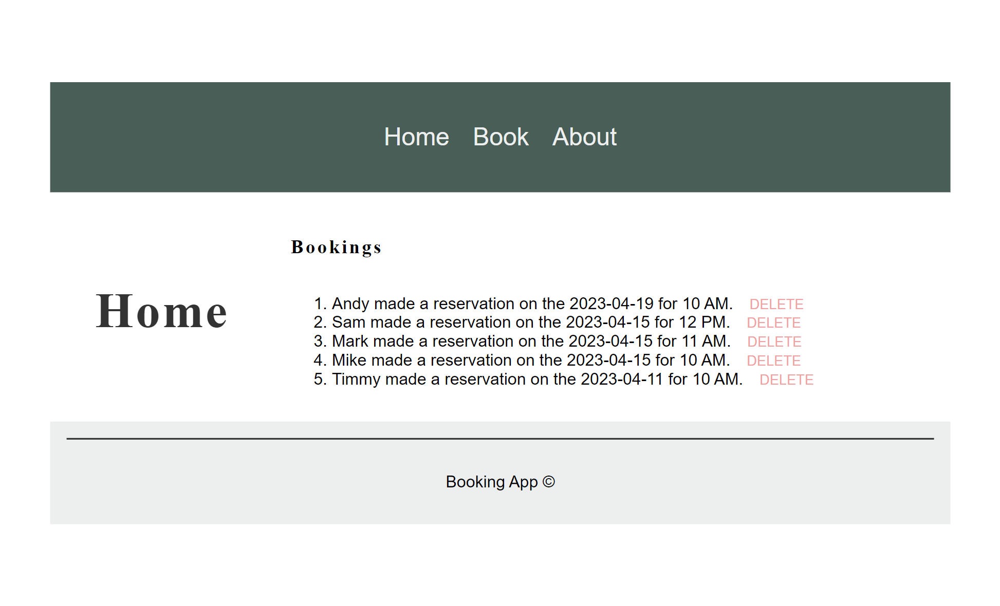

# 05-Booking-System-Django-AJAX
The project is a robust booking system web application developed using the Django framework. The main focus of the project was to demonstrate how to use the JavaScript fetch function to communicate with Django views. The application allows users to create, retrieve, and delete bookings easily. 
Upon launching the application, users are greeted with a homepage that lists all the bookings in a tabular format. The bookings are sorted in descending order based on their creation date. The homepage also has a DELETE button that users can use to remove any booking from the system. 
Apart from the homepage, the application has a Book tab that enables users to create a new booking. The form is well-designed and easy to use, and it provides all the necessary fields for creating a booking, including name, date and the check-in time slot. The slots that have already been taken will not be available for selection. 
To facilitate smooth communication between the client-side and server-side, the application utilizes AJAX operations on the Django views. Whenever a user performs a GET, POST, or DELETE operation, the application uses the JavaScript fetch function to send an asynchronous request to the Django views, which in turn processes the request and returns the appropriate response. This provides a better user experience as data can be changed on the server-side and depicted on the client-side without the need for reloading the page. 
The application uses a SQLite database by default, but it comes with all the preconfigured settings required to use a MySQL database. 
In summary, this project is a booking system web application that demonstrates how to use JavaScript fetch requests with Django views to create a smooth and seamless user experience. 

---

**Database structure:** 
 
Each booking will be represented in a table as follows: 

***id*** - primary key 
***name*** - char(max_length=150) 
***date*** - date 
***reservation_slot*** - int 

---

Useful Links: 

AJAX - fetch 
https://developer.mozilla.org/en-US/docs/Web/API/Fetch_API/Using_Fetch 

Django 
https://docs.djangoproject.com/en/4.1/ 

Python 3.11 
https://docs.python.org/3/ 

Environmental variables 
https://pypi.org/project/python-dotenv/ 

---

The necessary steps to make the program work: 
1. Install the Python version as stated in runtime.txt (python-3.11.2) 
2. Navigate in the console to the 05-Booking-System-Django-AJAX folder and install the required libraries from requirements.txt using the following command:  
*pip install -r requirements.txt* 
3. Change the name of .env.example to .env. 
4. Define the Django environmental variables in .env (https://docs.djangoproject.com/en/4.2/ref/settings/#std-setting-SECRET_KEY): 
**DJANGO_SECRET_KEY**="YOUR_DJANGO_SECRET_KEY" 
**MYSQL_PASSWORD**="your_mysql_Databse_passsword" - only needed if switched to MySQL database 
5. Run django migrations (https://docs.djangoproject.com/en/4.2/topics/migrations/). 
- python manage.py makemigrations  
- python manage.py migrate 
6. Now you can start the website with: 
- python manage.py runserver 
This will start the server in your local machine; the address will be something like: http://127.0.0.1:8000, and this is where your website will be ready to play with. 

Additional: 

**I. SWITCHING TO MySQL** 
The project was also preconfigured to use a MySQL database. In order to do so, necessary steps are needed. In the settings.py file, you would have to comment out the sqlite database settings and uncomment the MySQL database settings.
Next, you can use MySQL databases; just remember to check and adjust your settings for your MySQL database connection.
You will need: 
*'NAME':'mydatabase'*, - name of the database that you want to connect to. 
*'USER':'root'*, - name of the database user that you want to use for the connection 
*'PASSWORD':os.environ.get('MYSQL_PASSWORD')*, - password that you use to authenticate the user in the database 
*'HOST':'127.0.0.1'*, - host of the database to connect to 
*'PORT': '3306'*, - and port for the host 

 
You can also connect locally to a MySQL database, but first you will need to install and configure it on your local machine. For more information, follow this link: https://www.mysql.com/ 

---

**Example Website views:** 
 

***Home page without bookings.*** 
 
 

***Booking page view.*** 
 
 

***About page view.*** 
 
 

***Booking page - adding a booking.*** 
 
 

***Booking page - adding a booking (failed).*** 
 
 

***Booking page - updating available slots after making a booking.*** 
 
 

***Home page with listed bookings and a DELETE option for each of them.*** 
 
 

 

---

**The program was developed using python 3.11.2, Django 4.2, database - sqlite / MySQL, HTML, CSS, AJAX - asynchronous communication, JavaScript**
