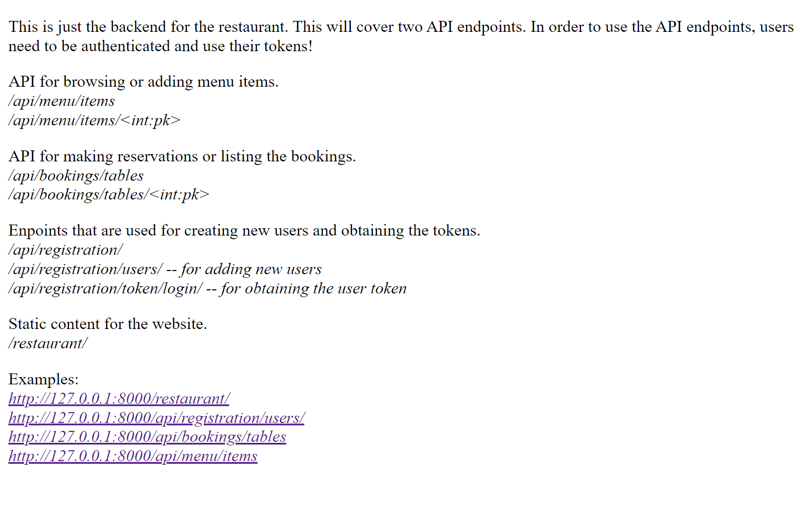
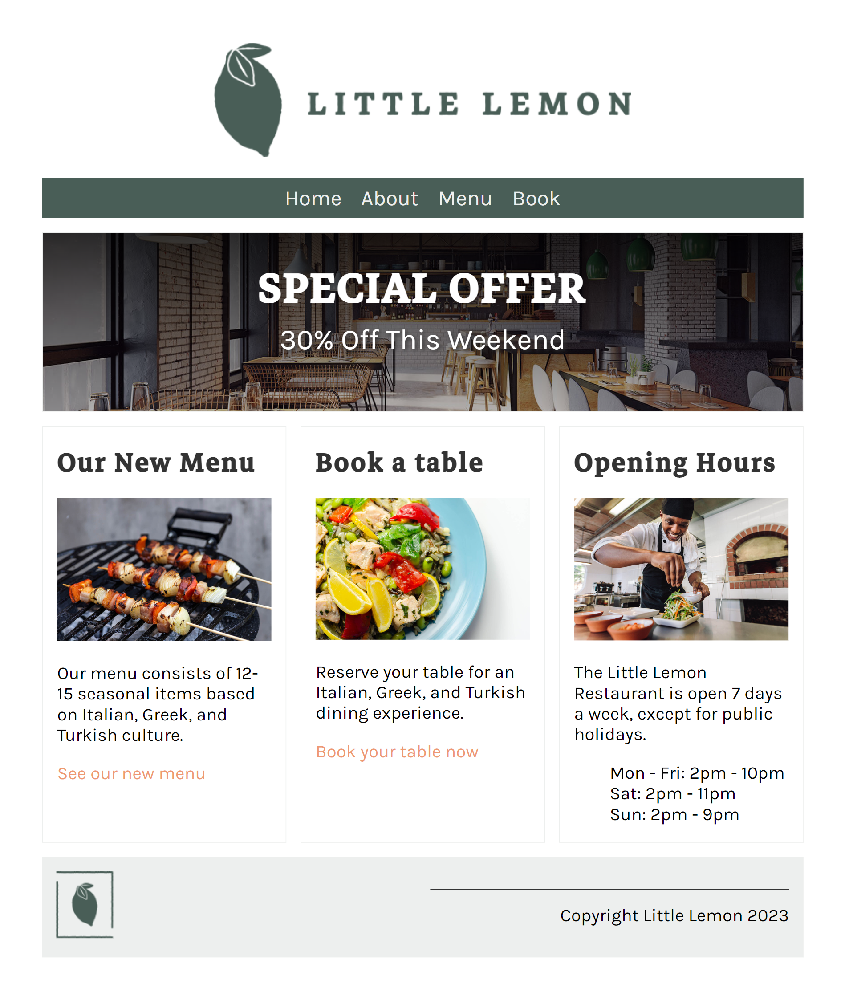
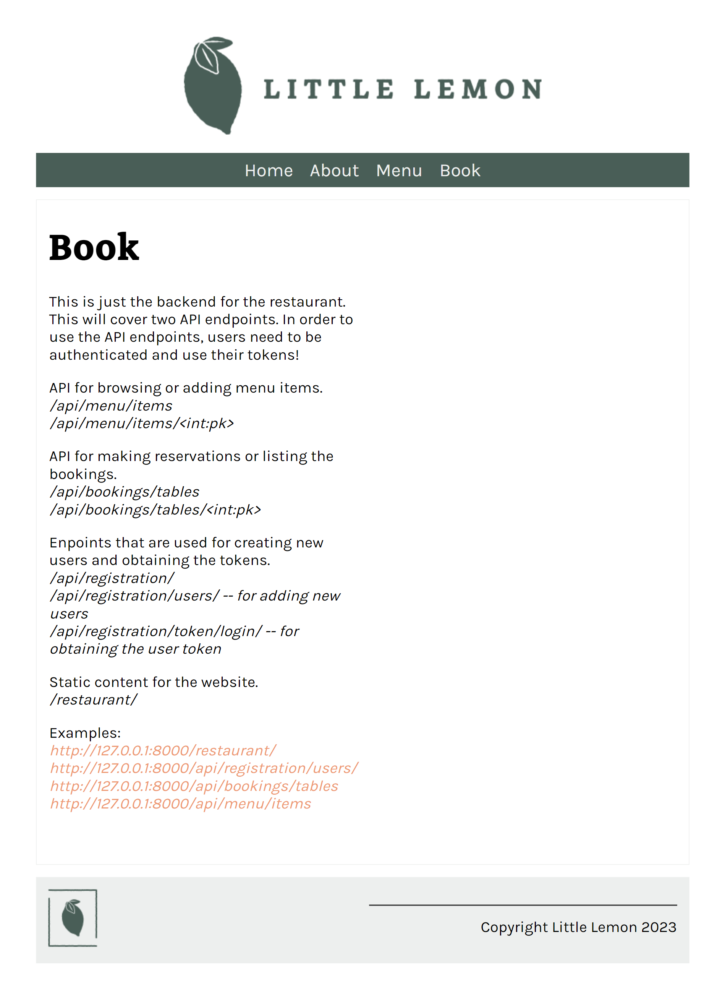
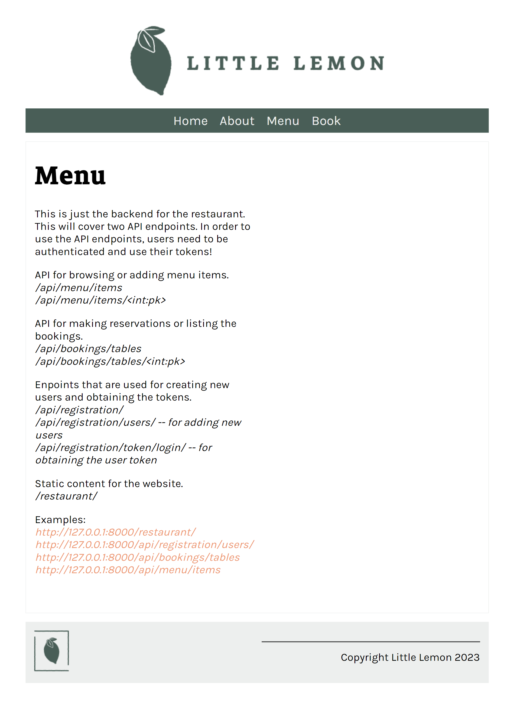
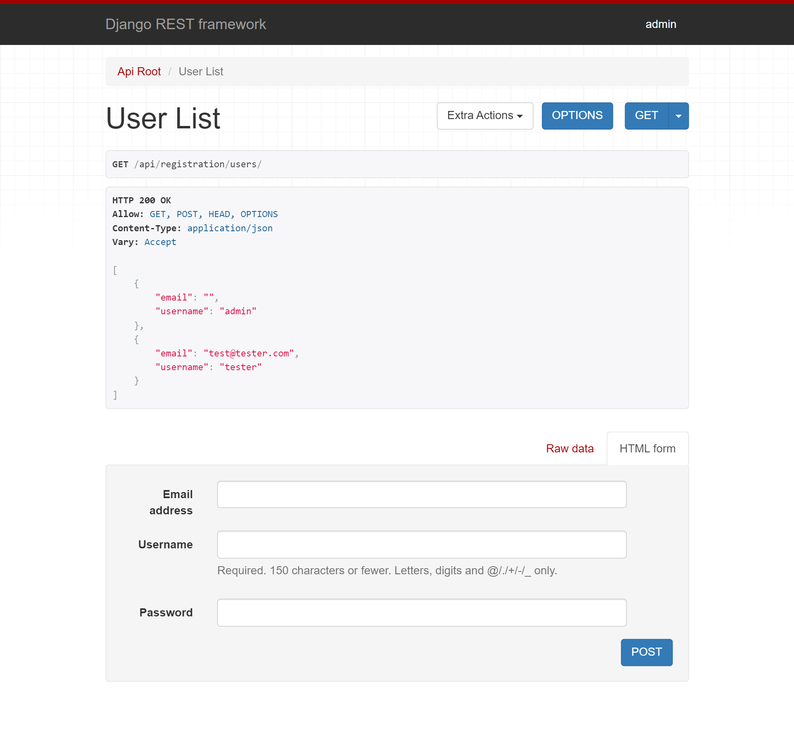
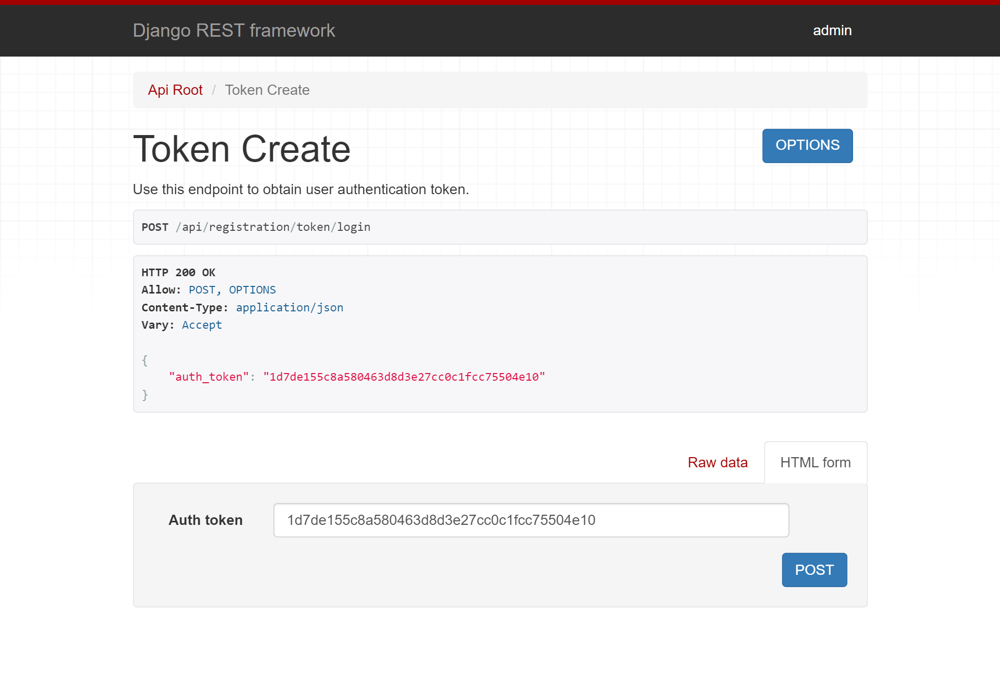
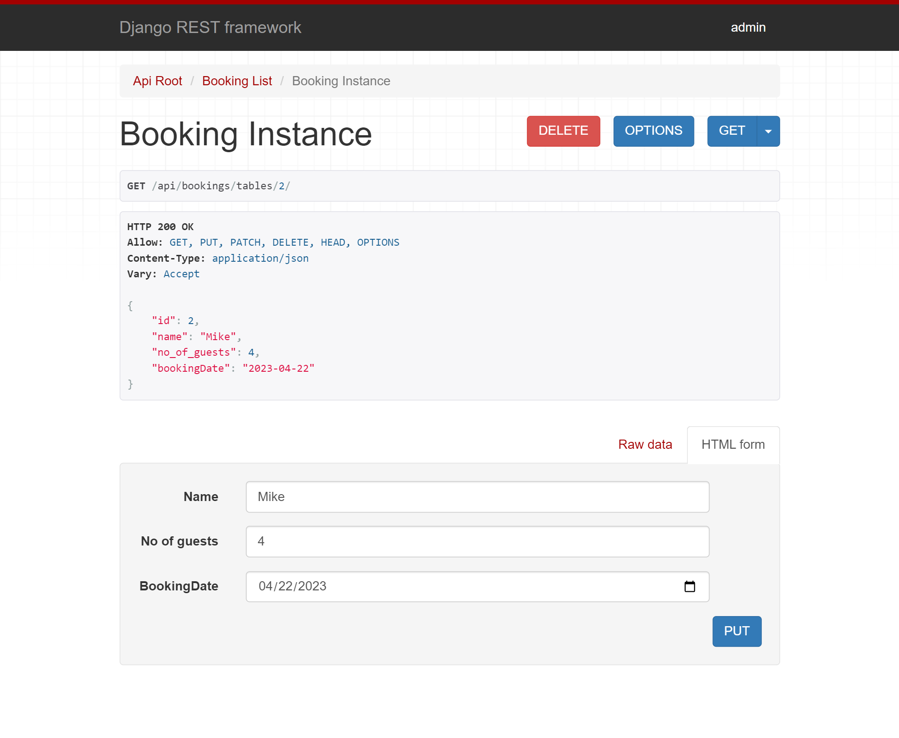
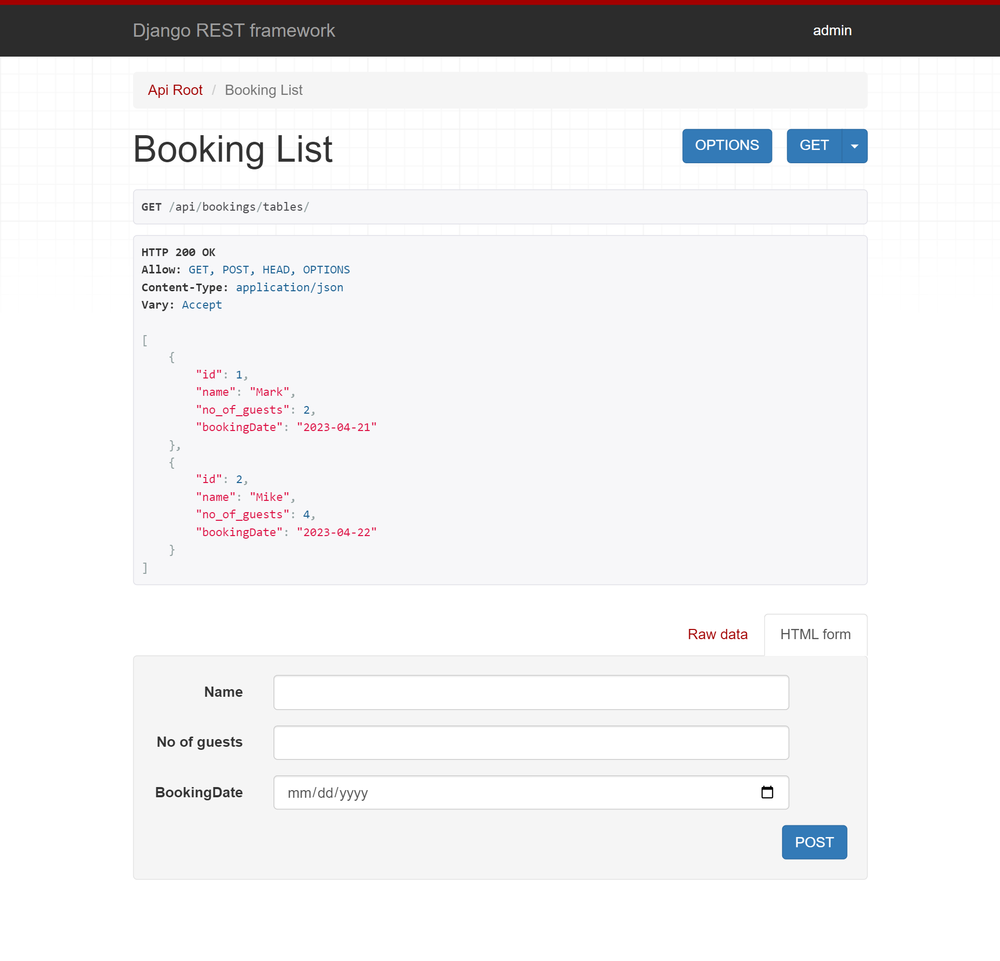
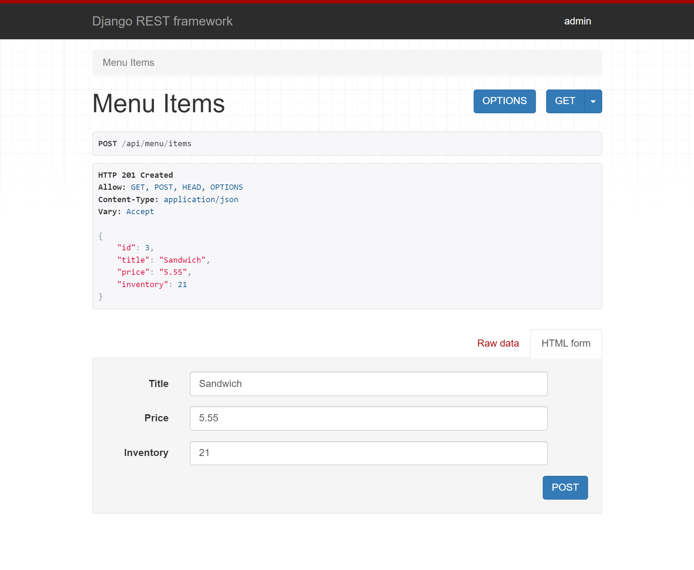
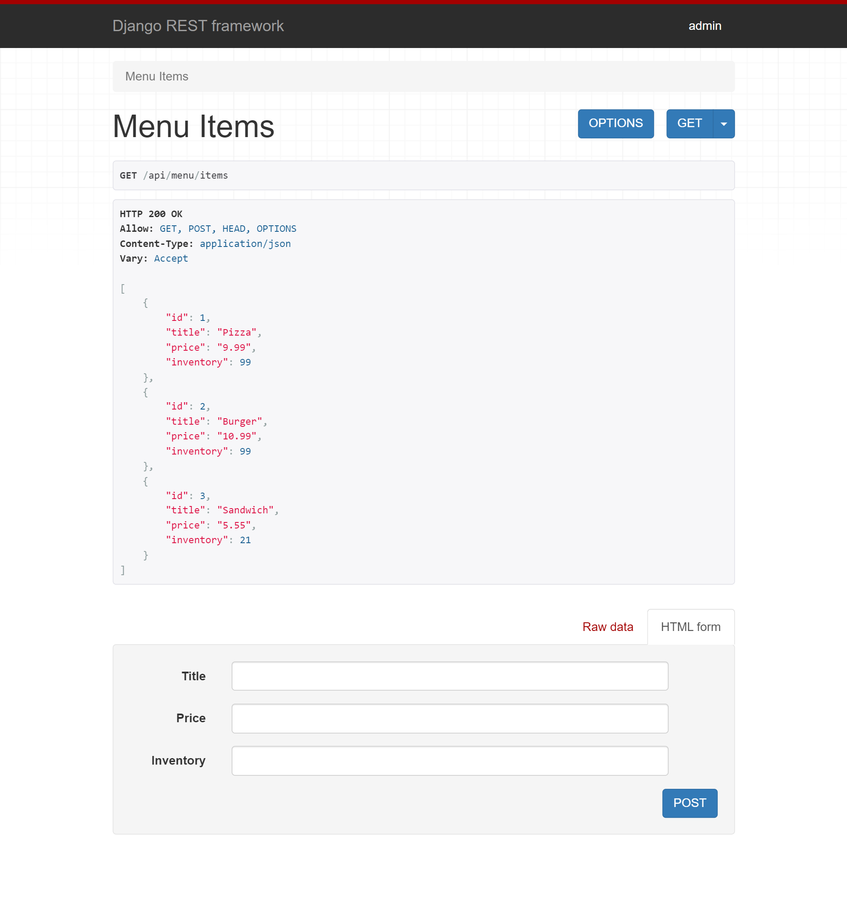

# 06-Booking_and_Menu_APIs_Restaurant_DRF

This is a restaurant project that will include two fully functional REST APIs built using Django and Django REST Framework for the Little Lemon restaurant. These APIs will serve as the backend for the restaurant and provide customers with the ability to browse/add food and reserve tables. To use the endpoints, each user will need to be authorized and authenticated by creating a username and password and obtaining their personal token. Each request will have to include a valid token. 
The project includes two endpoints for the APIs: the Menu API for browsing and adding food items, and the Table Booking API for reserving a table for dining at the restaurant on a specific date and for a certain number of people. The APIs will work based on the Menu and Booking models, using the provided model schema as the foundation for creating the required functionality for the restaurant. 
In addition, this project includes Django unittesting, which you can run with python manage.py test. These unit tests verify the basic functionality of the models and views used in the APIs. 

---

**ENDPOINTS and ROUTES** 

 

**WELCOME PAGE** 

| Endpoints 	| Method 	| DESCRIPTION  	|
|-----------	|--------	|--------------	|
| */*       	| *GET*    	| Welcome Page 	|

 

**ADMIN PAGE** 

| Endpoints 	| Method 	| DESCRIPTION  	|
|-----------	|--------	|--------------	|
| *admin/*      | *GET*    	| Admin Page 	|

 

**RESTAURANT PAGE** 
Static content of the website.  

| Endpoints 	     | Method 	| DESCRIPTION       	|
|------------------- |--------	|-------------------	|
| *restaurant/*      | *GET*    | Main Restaurant Page 	|
| *restaurant/about/*| *GET*    | About Restaurant Page |
| *restaurant/menu/* | *GET*    | Menu Restaurant Page  |
| *restaurant/book/* | *GET*    | Book Restaurant Page  |

 

**USER REGISTRATION AND TOKEN GENERATION** 
Here are djoser endpoints (https://djoser.readthedocs.io/en/latest/getting_started.html), listed only the most important; refer to the docs for more.
For authentication, you have to create a new user with a valid username and password; later, with this user, you can obtain a token, which you have to use in the HEADER of your request to authorise the request you will be making for any API call. 

| Endpoints      	                | Method 	| DESCRIPTION                                                         	                          |
|-------------------------------    |--------	|-----------------------------------------------------------------------------------------------  |
| */api/registration/users*         | *POST*   	| Creates a new user with the given: 'username', 'email', 'password'' 	                          |
| */api/registration/users*         | *GET*   	| Lists all users and their given 'username' and 'email' (authentication required)                |
| */api/registration/users/me/*     | *GET*    	| Displays only the current user (authentication required)            	                          |
| */api/registration/token/login/*	| *POST*   	| Generates access tokens that can be used in other API calls. Payload: 'password' and 'username' |

 

**MENU API** 
API for browsing or adding menu items. 
Authenticated users will have the ability to browse/add menu items. 
The Payload for the post/put request will have to include: "title", "price", "inventory". PATCH request will not require all fields. Validation Errors will be displayed to the user for the fields that are incorrect. All API calls will need a token to authenticate the user. 

| Endpoints                    	| Method     	| DESCRIPTION              	  |
|------------------------------	|------------	|---------------------------- |
| */api/menu/items*            	| *GET*        	| List all menu items.     	  |
| */api/menu/items*            	| *POST*       	| Creates a new menu item. 	  |
| */api/menu/items/{menuItemId}*| *GET*        	| Lists a single menu item.   |
| */api/menu/items/{menuItemId}*| *PUT*, *PATCH*| Updates a single menu item. |
| */api/menu/items/{menuItemId}*| *DELETE*     	| Deletes a single menu item. |

 

**BOOKING API** 
API for making reservations or listing the bookings. 
Authenticated users will have the ability to make reservations. 
The Payload for the post/put request will have to include: "name", "no_of_guests", "bookingDate". PATCH request will not require all fields. Validation Errors will be displayed to the user for the fields that are incorrect. All API calls will need a token to authenticate the user. 

| Endpoints                    	        | Method     	| DESCRIPTION              	|
|--------------------------------------	|------------	|--------------------------	|
| */api/bookings/tables*                | *GET*        	| List all bookings.     	|
| */api/bookings/tables*            	| *POST*       	| Creates a booking. 	    |
| */api/bookings/tables/{bookingId}*    | *GET*        	| Lists a single booking.  	|
| */api/bookings/tables/{bookingId}*    | *PUT*, *PATCH*| Updates a single booking. |
| */api/bookings/tables/{bookingId}*    | *DELETE*     	| Deletes a single booking.	|

 

Examples: 
- http://127.0.0.1:8000/restaurant/ 
- http://127.0.0.1:8000/api/registration/users/ 
- http://127.0.0.1:8000/api/bookings/tables 
- http://127.0.0.1:8000/api/menu/items 

 

---

 

The necessary steps to make the program work: 

Note that these instructions are for Windows users. Mac users will need to adjust them according to their system specifications. 

1. Install the Python version as stated in runtime.txt (python-3.11.2) 
2. Navigate in the console to the 06-Booking_and_Menu_APIs_Restaurant_DRF folder and install the required libraries from requirements.txt using the following command:  
*pip install -r requirements.txt* 
3. Change the name of .env.example to .env. 
4. Define the Django environmental variables in .env (https://docs.djangoproject.com/en/4.2/ref/settings/#std-setting-SECRET_KEY): 
**DJANGO_SECRET_KEY**="YOUR_DJANGO_SECRET_KEY" 
**MYSQL_PASSWORD**="your_mysql_Databse_passsword" - only needed if switching to MySQL database 
5. Run django migrations (https://docs.djangoproject.com/en/4.2/topics/migrations/). 
- python manage.py makemigrations  
- python manage.py migrate 
6. If you want to access the admin panel, you can create a superuser with the following command: 
- python manage.py createsuperuser 
7. Optionally, you can run the unit tests with the command (you can check the models and views if they work): 
- python manage.py test 
This will run the unittests located at littlelemon/restaurant/tests/test_models.py and test_views.py 
8. Now you can start the website with: 
- python manage.py runserver 
This will start the server in your local machine; the address will be something like: http://127.0.0.1:8000/, and this is where your website will be ready to play with. 
9. You can browse the website, and use the endpoints mentioned above to register users, get tokens, and with the APIs you can now add and list menu items and bookings. 

 

Additional: 

**I. SWITCHING TO MySQL** 
The project was also preconfigured to use a MySQL database. In order to do so, necessary steps are needed. In the settings.py file, you would have to comment out the sqlite database settings and uncomment the MySQL database settings.
Next, you can use MySQL databases; just remember to check and adjust your settings for your MySQL database connection.
You will need: 
*'NAME':'mydatabase'*, - name of the database that you want to connect to. 
*'USER':'root'*, - name of the database user that you want to use for the connection 
*'PASSWORD':os.environ.get('MYSQL_PASSWORD')*, - password that you use to authenticate the user in the database 
*'HOST':'127.0.0.1'*, - host of the database to connect to 
*'PORT': '3306'*, - and port for the host 

 
You can also connect locally to a MySQL database, but first you will need to install and configure it on your local machine. For more information, follow this link: https://www.mysql.com/ 

 

**II. How to test the API** 
There are various ways you can check the functionality of this API. Here are the three most common ways you could do that:
1. You can simply open your favourite browser and navigate to the endpoints; they will be displayed with the help of the Django REST framework API interface, which is interactive and gives you direct access to all the endpoints configured. Just remember that if you are logged in as an administrator, you will be authenticated as admin; since session authorization is also active, this would give you admin authorization for every endpoint. 
2. You can use POSTMAN (https://www.postman.com/) to check the endpoints and functionality. 
3. You can use INSOMNIA (https://insomnia.rest/) to check the endpoints and functionality. 

---

 

**Example responses / requests from the API and views from the website:** 
 

***Intro Website.*** 
***/*** 
 

***Static content - main Website.*** 
***restaurant/*** 
 

***Static content - main Website - mobile view.*** 
***restaurant/*** 
 

***Static content - about Website.*** 
***restaurant/about/*** 
 

***Static content - book Website.*** 
***restaurant/book/*** 
 

***Static content - menu Website.*** 
***restaurant/menu/*** 
 

***Register a user or list all users API.*** 
***/api/registration/users*** 
 

***Creates a token for the given user.*** 
***/api/registration/token/login/*** 
 

***Booking API - adding a new booking.*** 
***/api/bookings/tables*** 
 

***Booking API - listing all bookings.*** 
***/api/bookings/tables*** 
 

***Menu API - adding a new menu item.*** 
***/api/menu/items*** 
 

***Menu API - listing all menu items.*** 
***/api/menu/items*** 
 

---

 

**The program was developed using python 3.11.2, Django 4.2, Django REST framework, database - sqlite / MySQL, Djoser**
