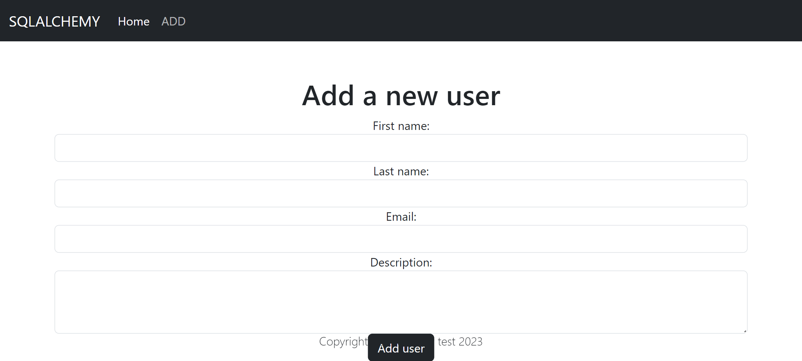
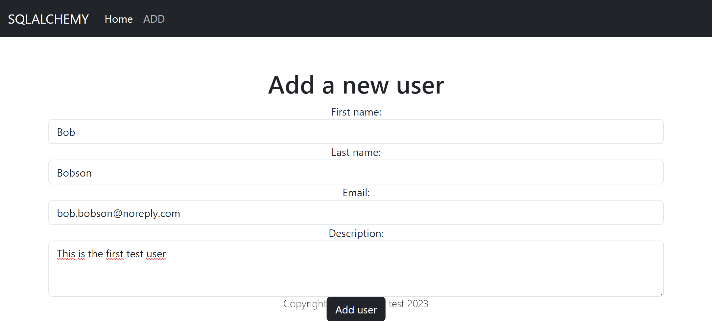
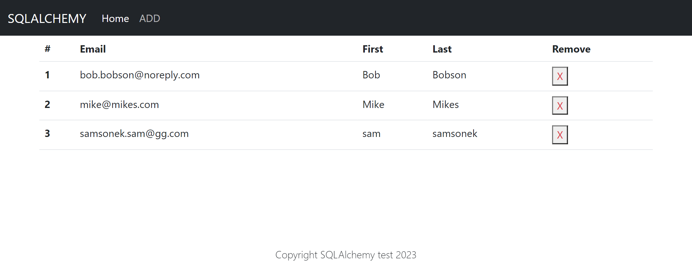
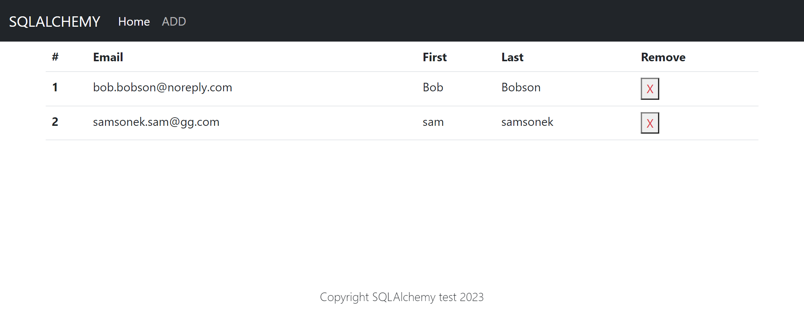

# 07-User_Management_SQLAlchemy_Django

The "User Management SQLAlchemy Django" project is a Python-based web application developed using the Django framework. This project serves as a comprehensive showcase for integrating SQLAlchemy, a powerful Object-Relational Mapping (ORM) library, with Django to perform database operations. Instead of utilizing Django's default ORM, this project demonstrates how SQLAlchemy can be seamlessly integrated into a Django project for enhanced flexibility and control over the database interactions. 

The project consists of two main websites, each serving distinct purposes. The first website provides a user listing page where all the users stored in the MySQL database are displayed. Additionally, it offers a visually appealing interface with a cross-shaped button next to each user entry, allowing administrators to delete users effortlessly. 

The second website focuses on user addition. It offers a user-friendly form created using Django's class-based views. When submitting the form, SQLAlchemy is employed to interact with the MySQL database. Before allowing the submission, the system performs a check to ensure that the user being added does not already exist in the database, preventing duplicates. This demonstrates how SQLAlchemy can be leveraged to handle both simple and complex database operations effectively. 

By combining Django's class-based views and the flexibility of SQLAlchemy, this project showcases how to perform Create, Read, Update, and Delete (CRUD) operations on a MySQL database in a Django application. The seamless integration of these powerful tools provides developers with greater control over the database layer and enables them to leverage SQLAlchemy's advanced features while enjoying the conveniences and rich ecosystem provided by the Django framework. 

"User Management SQLAlchemy Django" serves as a valuable resource for developers looking to explore alternative ORM solutions, extend Django's capabilities, and gain a deeper understanding of how SQLAlchemy and Django can work together harmoniously to build robust and efficient web applications. 

---

**ROUTES** 

***Route for listing all users and deleting them.*** 
***http://127.0.0.1:8000/users/*** 

***Route for adding new users.*** 
***http://127.0.0.1:8000/add/*** 

---

 

The necessary steps to make the program work: 

Note that these instructions are for Windows users. Mac users will need to adjust them according to their system specifications. 

1. Install the Python version as stated in runtime.txt (python-3.11.2) 
2. Navigate in the console to the 07-User_Management_SQLAlchemy_Django folder and install the required libraries from requirements.txt using the following command:  
*pip install -r requirements.txt* 
3. Change the name of .env.example to .env. 
4. Define the Django environmental variables in .env (https://docs.djangoproject.com/en/4.2/ref/settings/#std-setting-SECRET_KEY): 
**DJANGO_SECRET_KEY**="YOUR_DJANGO_SECRET_KEY" 
**MYSQL_PASSWORD**="your_mysql_Databse_passsword"  
**MYSQL_USER**='mysql_username'  
**MYSQL_DATABASE_NAME**='mysql_databse_name'  
**MYSQL_DATABASE_HOST**='mysql_databse_host'  
**MYSQL_DATABASE_PORT**='mysql_databse_port'  
5. Run django migrations (https://docs.djangoproject.com/en/4.2/topics/migrations/). 
- python manage.py makemigrations  
- python manage.py migrate  
6. Now you can start the website with: 
- python manage.py runserver 
This will start the server in your local machine; the address will be something like: http://127.0.0.1:8000/, and this is where your website will be ready to play with. 
7. Make sure you are connected to your MySQL database, for more information read bellow. 

 

Additional: 

**I. Using MySQL** 
The project was configured to use a MySQL database. In order to do so, necessary steps are needed.
You can use MySQL databases; just remember to check and adjust your settings for your MySQL database connection.
You will need (defined in the .env file): 
**MYSQL_PASSWORD**="your_mysql_Databse_passsword"  
**MYSQL_USER**='mysql_username'  
**MYSQL_DATABASE_NAME**='mysql_databse_name'  
**MYSQL_DATABASE_HOST**='mysql_databse_host'  
**MYSQL_DATABASE_PORT**='mysql_databse_port'  

 
You can also connect locally to a MySQL database, but first you will need to install and configure it on your local machine. For more information, follow this link: https://www.mysql.com/ 

---

 

**Example views from the website:** 
 

***Adding user view.*** 
 

***Adding user view.*** 
 

***List all users view.*** 
 

***List all users view - after deletion.*** 
 

---

 

**The program was developed using python 3.11.2, Django 4.2, database - MySQL, SQLAlchemy, HTML, Bootstrap 5**
